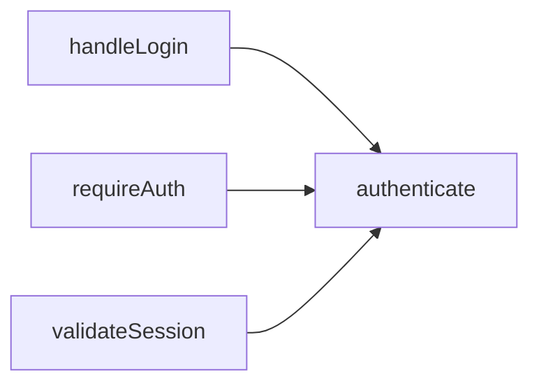
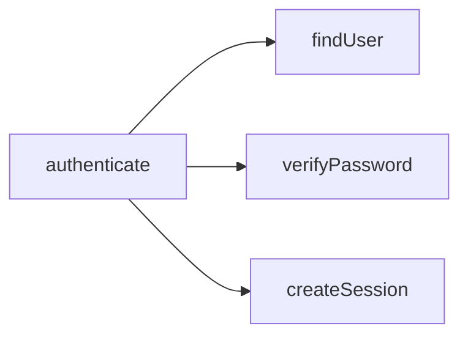
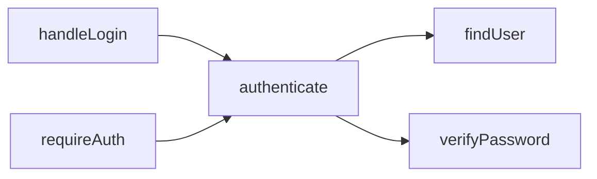

# doclea_call_graph

Get the call graph for a function or class, showing what calls it and what it calls.

**Category:** Code Scanning
**Status:** Stable

---

## Quick Example

```
"Show me what calls the authenticate function"
```

**Response:**

```json
{
  "message": "Call graph for authenticate (depth 2)",
  "graph": {
    "root": {
      "id": "src/auth.ts:function:authenticate",
      "name": "authenticate",
      "type": "function"
    },
    "incoming": [
      {
        "node": { "id": "src/api/login.ts:function:handleLogin", "name": "handleLogin" },
        "depth": 1
      },
      {
        "node": { "id": "src/middleware/auth.ts:function:requireAuth", "name": "requireAuth" },
        "depth": 1
      }
    ],
    "outgoing": [
      {
        "node": { "id": "src/db/users.ts:function:findUser", "name": "findUser" },
        "depth": 1
      },
      {
        "node": { "id": "src/crypto.ts:function:verifyPassword", "name": "verifyPassword" },
        "depth": 1
      }
    ]
  }
}
```

---

## Parameters

| Parameter | Type | Default | Description |
|-----------|------|---------|-------------|
| `nodeId` | `string` | - | Node ID to start from |
| `functionName` | `string` | - | Function name to search |
| `depth` | `number` | `2` | Levels to traverse (1-5) |
| `direction` | `string` | `"both"` | `"outgoing"`, `"incoming"`, or `"both"` |

**Note:** Provide either `nodeId` or `functionName`.

---

## Usage Examples

### What Calls This Function?

```
"What calls the processPayment function?"
```

```json
{
  "functionName": "processPayment",
  "direction": "incoming",
  "depth": 2
}
```

### What Does This Function Call?

```
"What functions does handleRequest call?"
```

```json
{
  "functionName": "handleRequest",
  "direction": "outgoing",
  "depth": 3
}
```

### Full Call Graph

```
"Show the complete call graph for UserService"
```

```json
{
  "nodeId": "src/services/user.ts:class:UserService",
  "direction": "both",
  "depth": 2
}
```

---

## Response Schema

```typescript
interface CallGraphResult {
  message: string;
  graph: {
    root: {
      id: string;
      name: string;
      type: string;
    };
    incoming: CallGraphNode[];   // What calls root
    outgoing: CallGraphNode[];   // What root calls
    totalNodes: number;
  };
}

interface CallGraphNode {
  node: {
    id: string;
    name: string;
    type: string;
    file?: string;
  };
  depth: number;                 // Distance from root
  callCount?: number;            // Times called (if available)
  children?: CallGraphNode[];    // Nested for depth > 1
}
```

---

## Direction Options

### `"incoming"` - Callers

Shows functions that call the target:



### `"outgoing"` - Callees

Shows functions the target calls:



### `"both"` - Full Graph

Shows both directions:



---

## Depth Control

| Depth | Shows |
|-------|-------|
| 1 | Direct callers/callees only |
| 2 | +1 level of indirect calls |
| 3 | +2 levels (recommended max) |
| 4-5 | Deep traversal (can be slow) |

**Example at depth 2:**

```
handleLogin → authenticate → findUser → queryDatabase
            ↑ depth 1      ↑ depth 2  (not shown at depth 2)
```

---

## Use Cases

### Understanding Code Flow

```
"Trace how a request flows through authentication"
```

```json
{
  "functionName": "handleRequest",
  "direction": "outgoing",
  "depth": 4
}
```

### Finding Entry Points

```
"What's the entry point that leads to this database call?"
```

```json
{
  "functionName": "executeSqlQuery",
  "direction": "incoming",
  "depth": 5
}
```

### Before Refactoring

```
"What would be affected if I change the signature of validateInput?"
```

```json
{
  "functionName": "validateInput",
  "direction": "incoming",
  "depth": 2
}
```

---

## Visualization

The response can be rendered as a graph:

```
authenticate
├── INCOMING (called by):
│   ├── handleLogin (src/api/login.ts)
│   │   └── routeHandler (src/routes.ts)
│   └── requireAuth (src/middleware/auth.ts)
│       └── protectedRoute (src/routes.ts)
└── OUTGOING (calls):
    ├── findUser (src/db/users.ts)
    │   └── queryDatabase (src/db/client.ts)
    └── verifyPassword (src/crypto.ts)
```

---

## Performance

| Depth | Typical Nodes | Time |
|-------|---------------|------|
| 1 | 5-20 | ~10ms |
| 2 | 20-100 | ~50ms |
| 3 | 50-500 | ~200ms |
| 4+ | 100-2000+ | ~1s+ |

**Tip:** Start with depth 2, increase if needed.

---

## Limitations

- Only tracks **static** calls (not dynamic/reflection)
- Callbacks may not be fully traced
- External library calls show as terminal nodes
- Recursive calls are detected but not infinitely expanded

---

## Related Tools

| Tool | When to Use |
|------|-------------|
| `doclea_impact_analysis` | Full impact assessment |
| `doclea_dependency_tree` | Module-level imports |
| `doclea_find_implementations` | Interface implementers |

---

## See Also

- [doclea_impact_analysis](./impact-analysis)
- [doclea_dependency_tree](./dependency-tree)
- [Code Scanning Overview](./overview)
