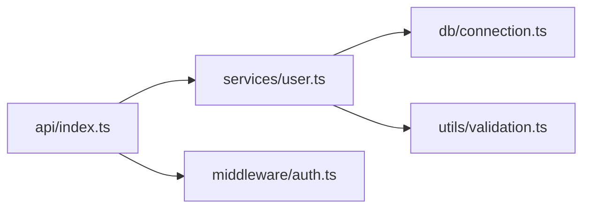
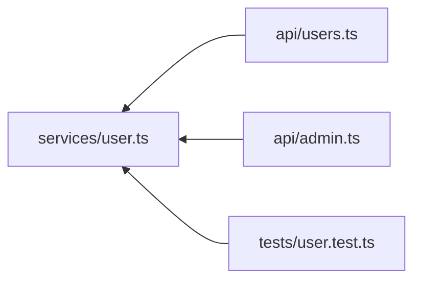

# doclea_dependency_tree

Show the import dependency tree for a module. Reveals what a module imports and what imports it.

**Category:** Code Scanning
**Status:** Stable

---

## Quick Example

```
"Show what src/api/index.ts imports"
```

**Response:**

```json
{
  "message": "Dependency tree for src/api/index.ts (depth 3)",
  "tree": {
    "root": {
      "id": "src/api/index.ts:module:",
      "file": "src/api/index.ts"
    },
    "imports": [
      {
        "module": "src/services/user.ts",
        "symbols": ["UserService"],
        "children": [
          {
            "module": "src/db/connection.ts",
            "symbols": ["getConnection"]
          },
          {
            "module": "src/utils/validation.ts",
            "symbols": ["validateEmail"]
          }
        ]
      },
      {
        "module": "src/middleware/auth.ts",
        "symbols": ["requireAuth", "optionalAuth"]
      }
    ],
    "importedBy": []
  }
}
```

---

## Parameters

| Parameter | Type | Default | Description |
|-----------|------|---------|-------------|
| `modulePath` | `string` | - | File path of the module |
| `moduleId` | `string` | - | Module node ID |
| `depth` | `number` | `3` | Traversal depth (1-10) |
| `direction` | `string` | `"imports"` | `"imports"`, `"importedBy"`, `"both"` |

---

## Usage Examples

### What Does This Module Import?

```
"What dependencies does the auth module have?"
```

```json
{
  "modulePath": "src/auth/index.ts",
  "direction": "imports",
  "depth": 3
}
```

### What Imports This Module?

```
"What files use the database module?"
```

```json
{
  "modulePath": "src/db/index.ts",
  "direction": "importedBy",
  "depth": 2
}
```

### Full Dependency Graph

```
"Show complete dependency graph for utils"
```

```json
{
  "modulePath": "src/utils/index.ts",
  "direction": "both",
  "depth": 2
}
```

---

## Response Schema

```typescript
interface DependencyTreeResult {
  message: string;
  tree: {
    root: {
      id: string;
      file: string;
    };
    imports: DependencyNode[];
    importedBy: DependencyNode[];
    totalModules: number;
    circularDependencies?: string[][];
  };
}

interface DependencyNode {
  module: string;              // File path
  symbols: string[];           // Imported symbols
  importType: "named" | "default" | "namespace" | "side-effect";
  children?: DependencyNode[]; // Nested for depth > 1
}
```

---

## Direction Options

### `"imports"` - Dependencies

What this module needs:



### `"importedBy"` - Dependents

What needs this module:



### `"both"` - Complete Graph

Shows full picture of a module's position in the codebase.

---

## Import Types

| Type | Example | Description |
|------|---------|-------------|
| `named` | `import { foo } from 'x'` | Named exports |
| `default` | `import foo from 'x'` | Default export |
| `namespace` | `import * as foo from 'x'` | Namespace import |
| `side-effect` | `import 'x'` | Side effects only |

---

## Circular Dependency Detection

When circular dependencies exist:

```json
{
  "circularDependencies": [
    ["src/a.ts", "src/b.ts", "src/a.ts"],
    ["src/services/user.ts", "src/services/auth.ts", "src/services/user.ts"]
  ]
}
```

**Warning:** Circular dependencies can cause runtime issues.

---

## Use Cases

### Bundle Analysis

```
"What would be bundled if I import from api/index?"
```

```json
{
  "modulePath": "src/api/index.ts",
  "direction": "imports",
  "depth": 10
}
```

### Dead Code Detection

```
"Is the legacy module still used?"
```

```json
{
  "modulePath": "src/legacy/old-api.ts",
  "direction": "importedBy",
  "depth": 1
}
```

Empty `importedBy` = potentially dead code.

### Layered Architecture Verification

```
"Does the UI layer import from data layer directly?"
```

Check if `src/ui/` imports from `src/data/` (violation) vs `src/services/` (correct).

### Refactoring Planning

```
"Before moving this module, what imports it?"
```

---

## Visualization

```
src/api/index.ts
├── IMPORTS:
│   ├── src/services/user.ts
│   │   ├── src/db/connection.ts
│   │   ├── src/db/queries.ts
│   │   └── src/utils/validation.ts
│   ├── src/services/auth.ts
│   │   └── src/crypto/jwt.ts
│   └── src/middleware/logging.ts
│
└── IMPORTED BY:
    ├── src/index.ts
    └── src/routes.ts
```

---

## Performance

| Depth | Typical Modules | Time |
|-------|-----------------|------|
| 1 | 5-15 | ~10ms |
| 3 | 20-100 | ~50ms |
| 5 | 50-500 | ~200ms |
| 10 | 100-2000+ | ~1s |

---

## Comparison with Call Graph

| Tool | Level | Shows |
|------|-------|-------|
| `doclea_dependency_tree` | Module | Import statements |
| `doclea_call_graph` | Function | Function calls |

Use both for complete understanding:
- Dependency tree shows file structure
- Call graph shows runtime behavior

---

## See Also

- [doclea_call_graph](./call-graph)
- [doclea_impact_analysis](./impact-analysis)
- [Code Scanning Overview](./overview)
