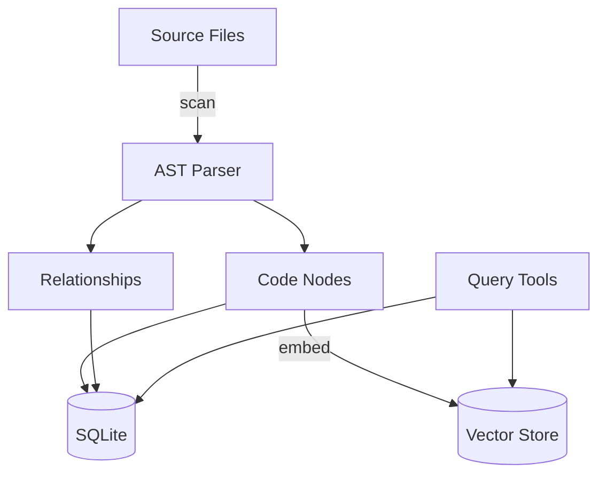

# Code Scanning Overview

Doclea's code scanning tools build a **Knowledge Graph (KAG)** of your codebase, extracting functions, classes, interfaces, and their relationships.

---

## Why Code Scanning?

Traditional search finds text. Code scanning understands **structure**:

| Need | Text Search | Code Scanning |
|------|-------------|---------------|
| "Find getUserData function" | Grep for string | Get exact node with signature |
| "What calls this function?" | Manual tracing | Automatic call graph |
| "What breaks if I change this?" | Hope and prayer | Impact analysis |
| "Who implements this interface?" | Search implements | Direct lookup |

---

## Architecture



### What Gets Extracted

| Node Type | Examples | Extracted Data |
|-----------|----------|----------------|
| `function` | `getUserData()`, `handleClick` | Signature, params, return type, JSDoc |
| `class` | `UserService`, `ApiClient` | Methods, properties, inheritance |
| `interface` | `IUserRepository`, `Config` | Properties, method signatures |
| `type` | `UserRole`, `ApiResponse` | Type definition |
| `module` | `src/api/users.ts` | Exports, imports |

### Relationships Tracked

| Relationship | Meaning |
|--------------|---------|
| `calls` | Function A calls function B |
| `implements` | Class implements interface |
| `extends` | Class/interface extends another |
| `imports` | Module imports from another |
| `exports` | Module exports symbol |
| `contains` | Class contains method |

---

## Quick Start

### 1. Scan Your Codebase

```
"Scan my codebase to build the code knowledge graph"
```

```json
{
  "patterns": ["src/**/*.ts", "src/**/*.tsx"],
  "incremental": true,
  "extractSummaries": true
}
```

### 2. Query the Graph

```
"Show me the call graph for the authenticate function"
```

```
"What would break if I change the UserService class?"
```

```
"Find all implementations of IRepository"
```

### 3. Keep It Updated

```
"Start watching for code changes"
```

Or run incremental scans periodically.

---

## All Code Scanning Tools

### Scanning & Indexing

| Tool | Purpose |
|------|---------|
| [`doclea_scan_code`](./scan-code) | Scan files, build knowledge graph |
| [`doclea_stop_watch`](./scan-code#stop-watcher) | Stop file watcher |

### Querying Nodes

| Tool | Purpose |
|------|---------|
| [`doclea_get_code_node`](./get-node) | Get node by ID, name, or file |
| [`doclea_find_implementations`](./find-implementations) | Find interface implementations |

### Relationship Analysis

| Tool | Purpose |
|------|---------|
| [`doclea_call_graph`](./call-graph) | Function call relationships |
| [`doclea_dependency_tree`](./dependency-tree) | Module import/export tree |
| [`doclea_impact_analysis`](./impact-analysis) | "What breaks if I change this?" |

### Summarization

| Tool | Purpose |
|------|---------|
| [`doclea_summarize_code`](./summarize) | Extract/generate summaries |
| [`doclea_get_unsummarized`](./summarize#get-unsummarized) | Find nodes needing AI summaries |
| [`doclea_update_code_summary`](./summarize#update-summary) | Update a single summary |
| [`doclea_batch_update_summaries`](./summarize#batch-update) | Batch update summaries |

---

## Supported Languages

| Language | File Extensions | Parser |
|----------|-----------------|--------|
| TypeScript | `.ts`, `.tsx` | Tree-sitter |
| JavaScript | `.js`, `.jsx` | Tree-sitter |
| Python | `.py` | Tree-sitter |
| Go | `.go` | Tree-sitter |
| Rust | `.rs` | Tree-sitter |

---

## Incremental Scanning

By default, scanning is **incremental**:

1. Tracks file modification times
2. Only re-parses changed files
3. Updates affected relationships
4. Preserves existing summaries

```json
{
  "incremental": true  // Default
}
```

For a full rescan:

```json
{
  "incremental": false
}
```

---

## File Watching

Enable continuous updates:

```json
{
  "watch": true
}
```

The watcher:
- Monitors for file changes
- Triggers incremental scans
- Updates graph in real-time
- Stops with `doclea_stop_watch`

---

## Integration with RAG

Code scanning creates a **KAG** (Knowledge-Augmented Graph) that complements **RAG** (Retrieval-Augmented Generation):

| System | Data | Use Case |
|--------|------|----------|
| **RAG** | Memories, decisions | "Why did we choose PostgreSQL?" |
| **KAG** | Code structure | "What calls the database layer?" |
| **Combined** | Both | "Show context for auth implementation" |

Use [`doclea_context`](../context/overview) to combine both in a single query.

---

## Best Practices

### Do

- Run initial full scan on project setup
- Enable incremental scanning for daily use
- Use file watcher during active development
- Generate AI summaries for public APIs

### Don't

- Scan `node_modules` or `vendor` directories
- Run full scans on every commit
- Ignore the default exclude patterns

---

## Performance

| Operation | 10K LOC | 100K LOC | 1M LOC |
|-----------|---------|----------|--------|
| Full scan | ~2s | ~15s | ~2min |
| Incremental (10 files) | ~200ms | ~200ms | ~200ms |
| Call graph (depth 2) | ~10ms | ~50ms | ~200ms |
| Impact analysis | ~20ms | ~100ms | ~500ms |

---

## Next Steps

- [doclea_scan_code](./scan-code) - Start scanning
- [doclea_call_graph](./call-graph) - Explore relationships
- [doclea_impact_analysis](./impact-analysis) - Analyze changes
