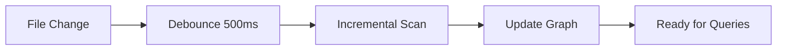

# doclea_scan_code

Scan source code to build a knowledge graph (KAG) of functions, classes, interfaces, and their relationships.

**Category:** Code Scanning
**Status:** Stable

---

## Quick Example

```
"Scan my TypeScript files to build the code graph"
```

**Response:**

```json
{
  "message": "Scanned 45 files, extracted 312 nodes",
  "result": {
    "stats": {
      "filesScanned": 45,
      "nodesExtracted": 312,
      "relationsCreated": 847,
      "summariesExtracted": 156
    }
  }
}
```

---

## Parameters

| Parameter | Type | Default | Description |
|-----------|------|---------|-------------|
| `patterns` | `string[]` | `["**/*.{ts,tsx,js,jsx,py,go,rs}"]` | Glob patterns for files to scan |
| `exclude` | `string[]` | See below | Patterns to exclude |
| `incremental` | `boolean` | `true` | Only scan changed files |
| `watch` | `boolean` | `false` | Start file watcher |
| `extractSummaries` | `boolean` | `true` | Extract JSDoc/docstrings |

### Default Excludes

```json
[
  "node_modules/**",
  ".git/**",
  "dist/**",
  "build/**",
  "coverage/**",
  "*.min.js",
  "*.bundle.js"
]
```

---

## Usage Examples

### Basic Scan

```
"Scan the codebase"
```

```json
{
  "incremental": true,
  "extractSummaries": true
}
```

### Scan Specific Patterns

```
"Scan only the API layer"
```

```json
{
  "patterns": ["src/api/**/*.ts", "src/services/**/*.ts"],
  "incremental": true
}
```

### Full Rescan

```
"Do a full rescan of everything"
```

```json
{
  "incremental": false
}
```

### With File Watcher

```
"Scan and watch for changes"
```

```json
{
  "watch": true,
  "incremental": true
}
```

---

## Response Schema

```typescript
interface ScanResult {
  message: string;
  result: {
    stats: {
      filesScanned: number;
      filesSkipped: number;      // Unchanged in incremental
      nodesExtracted: number;
      nodesUpdated: number;      // Existing nodes updated
      relationsCreated: number;
      summariesExtracted: number;
      errors: number;
    };
    watcherStarted?: boolean;
  };
}
```

---

## Incremental Scanning

When `incremental: true` (default):

1. **Checks modification times** against last scan
2. **Skips unchanged files** completely
3. **Re-parses changed files** and updates nodes
4. **Cleans up deleted nodes** from removed files
5. **Updates relationships** affected by changes

### When to Use Full Scan

- Initial project setup
- After major refactoring
- If graph seems inconsistent
- After changing exclude patterns

---

## File Watcher

When `watch: true`:



### Watcher Behavior

| Event | Action |
|-------|--------|
| File created | Add to graph |
| File modified | Update nodes |
| File deleted | Remove from graph |
| File renamed | Delete old, add new |

### Stop the Watcher {#stop-watcher}

```
"Stop watching for code changes"
```

**Tool:** `doclea_stop_watch`

```json
{
  "message": "File watcher stopped"
}
```

---

## What Gets Extracted

### Functions

```typescript
// Extracted as node
export function processPayment(
  amount: number,
  currency: string
): Promise<Receipt> {
  // ...
}
```

**Node:**
```json
{
  "id": "src/payments.ts:function:processPayment",
  "type": "function",
  "name": "processPayment",
  "signature": "(amount: number, currency: string) => Promise<Receipt>",
  "exported": true,
  "async": true,
  "location": { "file": "src/payments.ts", "line": 15 }
}
```

### Classes

```typescript
export class PaymentService implements IPaymentProcessor {
  async charge(amount: number): Promise<void> { }
}
```

**Node:**
```json
{
  "id": "src/payments.ts:class:PaymentService",
  "type": "class",
  "name": "PaymentService",
  "implements": ["IPaymentProcessor"],
  "methods": ["charge"],
  "exported": true
}
```

### Interfaces

```typescript
export interface IPaymentProcessor {
  charge(amount: number): Promise<void>;
  refund(transactionId: string): Promise<void>;
}
```

**Node:**
```json
{
  "id": "src/types.ts:interface:IPaymentProcessor",
  "type": "interface",
  "name": "IPaymentProcessor",
  "methods": ["charge", "refund"],
  "exported": true
}
```

---

## Summary Extraction

When `extractSummaries: true`:

### From JSDoc

```typescript
/**
 * Process a payment transaction.
 * @param amount - Amount in cents
 * @param currency - ISO currency code
 * @returns Receipt with transaction ID
 */
export function processPayment(amount: number, currency: string) { }
```

**Extracted summary:** "Process a payment transaction."

### From Python Docstrings

```python
def process_payment(amount: int, currency: str) -> Receipt:
    """
    Process a payment transaction.

    Args:
        amount: Amount in cents
        currency: ISO currency code

    Returns:
        Receipt with transaction ID
    """
```

### Confidence Scoring

| Source | Confidence |
|--------|------------|
| JSDoc with description | 0.9 |
| Docstring present | 0.85 |
| Name-based heuristic | 0.3 |
| No documentation | 0.0 |

Low-confidence nodes are flagged for AI summarization.

---

## Error Handling

| Error | Cause | Resolution |
|-------|-------|------------|
| Parse error | Invalid syntax | File skipped, error logged |
| Permission denied | File not readable | Check file permissions |
| Pattern matches nothing | Wrong glob | Verify patterns |

Errors don't stop the scan - problematic files are skipped and reported.

---

## Performance Tips

### Large Codebases

```json
{
  "patterns": ["src/**/*.ts"],
  "exclude": ["**/*.test.ts", "**/*.spec.ts", "**/__tests__/**"],
  "incremental": true
}
```

### Monorepos

Scan packages separately:

```json
{
  "patterns": ["packages/core/src/**/*.ts"]
}
```

Then:

```json
{
  "patterns": ["packages/api/src/**/*.ts"]
}
```

---

## Integration with Other Tools

After scanning:

| Tool | Use Case |
|------|----------|
| `doclea_get_code_node` | Query specific nodes |
| `doclea_call_graph` | Explore call relationships |
| `doclea_impact_analysis` | Analyze change impact |
| `doclea_get_unsummarized` | Find nodes needing AI summaries |

---

## See Also

- [Code Scanning Overview](./overview)
- [doclea_get_code_node](./get-node)
- [doclea_call_graph](./call-graph)
