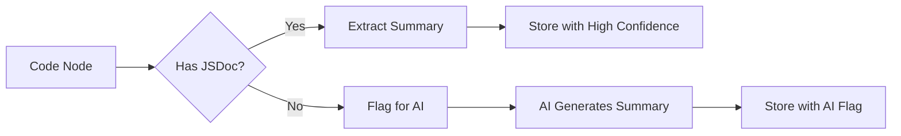

# Code Summarization

Generate summaries for code nodes using heuristic extraction and AI enhancement. Good summaries improve semantic search and code understanding.

---

## Overview

Doclea uses a **hybrid summarization** approach:

1. **Heuristic extraction** - Pull summaries from JSDoc, docstrings, comments
2. **AI enhancement** - Generate summaries for undocumented code



---

## Tools

| Tool | Purpose |
|------|---------|
| `doclea_summarize_code` | Run summarization pipeline |
| `doclea_get_unsummarized` | Find nodes needing AI summaries |
| `doclea_update_code_summary` | Update a single summary |
| `doclea_batch_update_summaries` | Batch update multiple summaries |

---

## doclea_summarize_code

Run heuristic summarization and identify nodes needing AI summaries.

### Parameters

| Parameter | Type | Default | Description |
|-----------|------|---------|-------------|
| `filePath` | `string` | - | Specific file to process |
| `directory` | `string` | - | Directory to scan |
| `patterns` | `string[]` | `["**/*.ts"]` | Glob patterns |
| `strategy` | `string` | `"hybrid"` | `"heuristic"` or `"hybrid"` |
| `forceRegenerate` | `boolean` | `false` | Regenerate existing |
| `preferAiForExported` | `boolean` | `true` | Flag exported APIs for AI |

### Example

```
"Generate summaries for the auth module"
```

```json
{
  "directory": "src/auth",
  "strategy": "hybrid",
  "preferAiForExported": true
}
```

### Response

```json
{
  "message": "Processed 45 nodes",
  "stats": {
    "processed": 45,
    "heuristicExtracted": 28,
    "needsAiSummary": 17,
    "skipped": 0
  },
  "needsAiSummary": [
    {
      "nodeId": "src/auth/jwt.ts:function:verifyToken",
      "name": "verifyToken",
      "type": "function",
      "code": "export function verifyToken(token: string): JwtPayload | null { ... }",
      "reason": "Exported function without JSDoc"
    }
  ]
}
```

---

## doclea_get_unsummarized {#get-unsummarized}

Get code nodes that need AI-generated summaries.

### Parameters

| Parameter | Type | Default | Description |
|-----------|------|---------|-------------|
| `filePath` | `string` | - | Filter by file |
| `limit` | `number` | `10` | Max nodes to return |
| `includeCode` | `boolean` | `true` | Include source code |
| `confidenceThreshold` | `number` | `0.6` | Return below this |

### Example

```
"Get 5 functions that need AI summaries"
```

```json
{
  "limit": 5,
  "includeCode": true,
  "confidenceThreshold": 0.6
}
```

### Response

```json
{
  "message": "Found 5 nodes needing summaries",
  "total": 23,
  "nodes": [
    {
      "nodeId": "src/api/users.ts:function:createUser",
      "name": "createUser",
      "type": "function",
      "signature": "(data: CreateUserInput) => Promise<User>",
      "currentSummary": null,
      "confidence": 0,
      "code": "export async function createUser(data: CreateUserInput): Promise<User> {\n  const validated = validateUserInput(data);\n  const hashed = await hashPassword(validated.password);\n  return db.users.create({ ...validated, password: hashed });\n}"
    }
  ]
}
```

### Workflow

1. Call `doclea_get_unsummarized` to get nodes
2. Generate summaries with your LLM
3. Call `doclea_batch_update_summaries` to store them

---

## doclea_update_code_summary {#update-summary}

Update the summary for a single code node.

### Parameters

| Parameter | Type | Description |
|-----------|------|-------------|
| `nodeId` | `string` | Node ID to update |
| `summary` | `string` | AI-generated summary |

### Example

```json
{
  "nodeId": "src/api/users.ts:function:createUser",
  "summary": "Creates a new user account with validated input and hashed password. Returns the created user object."
}
```

### Response

```json
{
  "success": true,
  "message": "Summary updated for createUser"
}
```

---

## doclea_batch_update_summaries {#batch-update}

Update summaries for multiple nodes at once.

### Parameters

| Parameter | Type | Description |
|-----------|------|-------------|
| `summaries` | `array` | Array of `{nodeId, summary}` (1-50 items) |

### Example

```json
{
  "summaries": [
    {
      "nodeId": "src/api/users.ts:function:createUser",
      "summary": "Creates a new user with hashed password"
    },
    {
      "nodeId": "src/api/users.ts:function:deleteUser",
      "summary": "Soft-deletes a user by ID"
    },
    {
      "nodeId": "src/api/users.ts:function:updateUser",
      "summary": "Updates user fields with validation"
    }
  ]
}
```

### Response

```json
{
  "message": "Updated 3 summaries (0 failed)",
  "updated": 3,
  "failed": 0
}
```

---

## Summary Quality

### Good Summaries

```
✓ "Validates user input and returns normalized data with error messages"
✓ "Authenticates user by email/password, returns JWT token on success"
✓ "Recursively traverses AST nodes, extracting function declarations"
```

### Bad Summaries

```
✗ "This function does stuff" (too vague)
✗ "validateUser" (just the name)
✗ "Validates user input and checks if the email is valid and..." (too long)
```

### Guidelines

| Aspect | Guideline |
|--------|-----------|
| Length | 1-2 sentences, <100 chars ideal |
| Content | What it does, not how |
| Specificity | Include key behaviors |
| Format | Start with verb (validates, creates, returns) |

---

## Confidence Scoring

| Confidence | Source | Meaning |
|------------|--------|---------|
| 0.9+ | JSDoc with description | High quality |
| 0.7-0.9 | Docstring, brief JSDoc | Good quality |
| 0.5-0.7 | AI-generated | Review suggested |
| 0.3-0.5 | Name-based heuristic | Likely needs improvement |
| 0-0.3 | No documentation | Definitely needs AI |

---

## Workflow: Summarize Entire Codebase

### Step 1: Initial Extraction

```json
{
  "directory": "src",
  "strategy": "hybrid",
  "preferAiForExported": true
}
```

### Step 2: Get Unsummarized (Batched)

```json
{
  "limit": 20,
  "includeCode": true
}
```

### Step 3: Generate with LLM

For each node, prompt your LLM:

```
Generate a concise summary (1-2 sentences) for this function:

Name: createUser
Signature: (data: CreateUserInput) => Promise<User>
Code:
export async function createUser(data: CreateUserInput): Promise<User> {
  const validated = validateUserInput(data);
  const hashed = await hashPassword(validated.password);
  return db.users.create({ ...validated, password: hashed });
}
```

### Step 4: Batch Update

```json
{
  "summaries": [
    { "nodeId": "...", "summary": "..." },
    { "nodeId": "...", "summary": "..." }
  ]
}
```

### Step 5: Repeat

Continue until `doclea_get_unsummarized` returns empty.

---

## Integration with Search

Summaries improve semantic search:

```
"Find functions that handle user authentication"
```

Without summaries: Matches `authenticate` in name only
With summaries: Matches any function described as handling auth

---

## See Also

- [doclea_scan_code](./scan-code)
- [Code Scanning Overview](./overview)
- [doclea_context](../context/overview)
