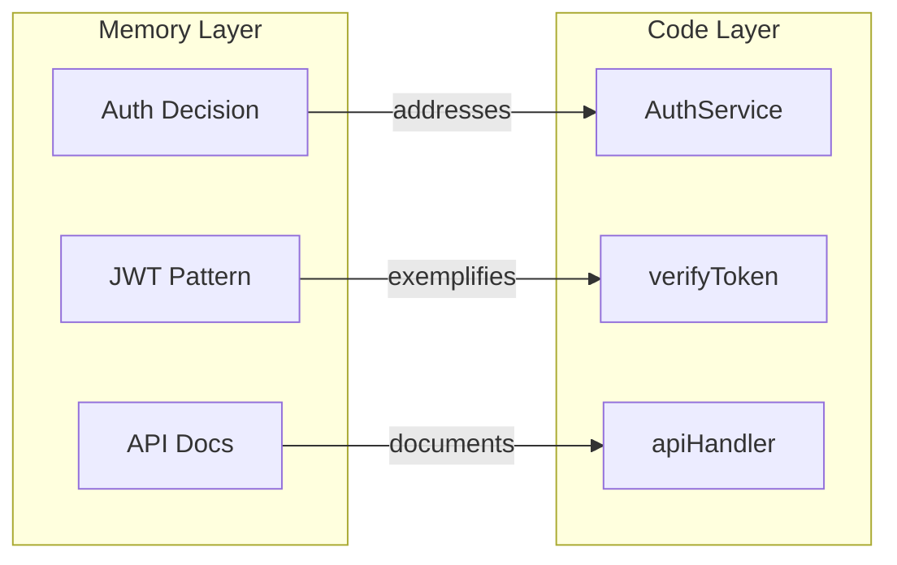

# Cross-Layer Relations

Connect code entities from the Knowledge Graph (KAG) with memories from the Retrieval-Augmented Generation (RAG) system. Build a unified knowledge base that links documentation to implementation.

---

## Overview

Doclea maintains two knowledge layers:

1. **RAG Layer (Memories)** - Human-written documentation, decisions, patterns
2. **KAG Layer (Code)** - Parsed code structure (functions, classes, modules)

Cross-layer relations **bridge these layers**, enabling:

- Find code that implements a documented decision
- Find documentation for a specific function
- Trace patterns to their concrete implementations
- Unified context that spans docs and code



---

## Relation Types

| Type | Direction | Meaning |
|------|-----------|---------|
| `documents` | Memory → Code | Memory describes how code works |
| `addresses` | Code → Memory | Code implements a decision/requirement |
| `exemplifies` | Code → Memory | Code demonstrates a pattern |

### `documents`

A memory that explains or documents a code entity.

```
Memory: "How the JWT verification works"
    ↓ documents
Code: verifyToken() function
```

**Detected by:** Code references in memory, file path overlap

### `addresses`

Code that implements an architecture decision or requirement.

```
Memory: "Use JWT for stateless auth" (decision)
    ↑ addresses
Code: AuthService class
```

**Detected by:** Keyword matching with decision/architecture memories

### `exemplifies`

Code that demonstrates a documented pattern.

```
Memory: "Repository Pattern" (pattern)
    ↑ exemplifies
Code: UserRepository class
```

**Detected by:** Code references in pattern memories, keyword matching

---

## Direction

Cross-layer relations are **directional**:

| Direction | From | To | Relation Types |
|-----------|------|-----|----------------|
| `memory_to_code` | Memory | Code | `documents` |
| `code_to_memory` | Code | Memory | `addresses`, `exemplifies` |

---

## Tools

| Tool | Purpose |
|------|---------|
| [`doclea_suggest_crosslayer`](./suggest-crosslayer) | Detect relations for an entity |
| [`doclea_get_code_for_memory`](./get-code-for-memory) | Find code linked to a memory |
| [`doclea_get_memories_for_code`](./get-memories-for-code) | Find memories linked to code |
| [`doclea_get_crosslayer_suggestions`](./get-crosslayer-suggestions) | View pending suggestions |
| [`doclea_review_crosslayer`](./review-crosslayer) | Approve/reject a suggestion |
| [`doclea_bulk_review_crosslayer`](./bulk-review-crosslayer) | Batch review suggestions |

---

## Detection Methods

### `code_reference`

Detects backtick-quoted code references in memory content:

```markdown
The `verifyToken` function handles JWT validation.
```
→ Links memory to the `verifyToken` code node

**Confidence:** 0.9 (high - explicit reference)

### `file_path_match`

Matches memory's `relatedFiles` with code graph:

```json
{
  "title": "Auth Handler Documentation",
  "relatedFiles": ["src/auth/handler.ts"]
}
```
→ Links to all code nodes in `src/auth/handler.ts`

**Confidence:** 0.75 (medium - file-level match)

### `keyword_match`

Matches keywords between code and memory:

```
Code: "UserRepository" class
Memory: "Repository Pattern" with keywords ["repository", "data access"]
```
→ Links if keyword overlap > 40%

**Confidence:** 0.6-0.75 (varies by overlap)

---

## Confidence Thresholds

| Threshold | Range | Action |
|-----------|-------|--------|
| **Auto-approve** | ≥0.85 | Relation created immediately |
| **Suggestion** | 0.6-0.85 | Stored for review |
| **Discard** | <0.6 | Not stored |

---

## Workflow

### 1. Scan Code

First, scan your codebase to build the KAG:

```json
// doclea_scan_code
{ "patterns": ["**/*.ts"] }
```

### 2. Store Memories

Store documentation with file references:

```json
// doclea_store
{
  "title": "Auth Service Documentation",
  "content": "The `AuthService` class handles...",
  "relatedFiles": ["src/auth/service.ts"]
}
```

### 3. Detect Relations

Run cross-layer detection:

```json
// doclea_suggest_crosslayer
{ "entityId": "mem_auth_docs", "entityType": "memory" }
```

### 4. Review Suggestions

```json
// doclea_review_crosslayer
{ "suggestionId": "csug_abc123", "action": "approve" }
```

### 5. Query Relations

```json
// doclea_get_code_for_memory
{ "memoryId": "mem_auth_docs" }

// doclea_get_memories_for_code
{ "codeNodeId": "src/auth/service.ts:class:AuthService" }
```

---

## Use Cases

### Documentation Discovery

"What documentation exists for this function?"

```json
{
  "codeNodeId": "src/api/users.ts:function:createUser"
}
```

### Code Discovery

"What code implements this decision?"

```json
{
  "memoryId": "mem_jwt_decision"
}
```

### Context Building

When building context, include both:
- The memory
- Related code entities
- Linked memories from code

### Knowledge Verification

Ensure decisions are implemented:

```
For each decision memory:
  Check: Are there code nodes that "address" it?
  If not: Flag as unimplemented
```

---

## Integration

### With Context Building

Cross-layer relations enrich context:

```
Query: "How does auth work?"
Context includes:
  - Auth memories
  - Linked code nodes
  - Code summaries
```

### With Code Scanning

Cross-layer detection can run after code scanning to find new relations.

### With Memory Storage

Auto-detect cross-layer relations when storing memories with `relatedFiles`.

---

## Database Schema

### Relations Table

```sql
CREATE TABLE cross_layer_relations (
  id TEXT PRIMARY KEY,
  memory_id TEXT NOT NULL,
  code_node_id TEXT NOT NULL,
  relation_type TEXT NOT NULL,
  direction TEXT NOT NULL,
  confidence REAL NOT NULL,
  metadata TEXT,
  created_at INTEGER NOT NULL,
  UNIQUE(memory_id, code_node_id, relation_type)
);
```

### Suggestions Table

```sql
CREATE TABLE cross_layer_suggestions (
  id TEXT PRIMARY KEY,
  memory_id TEXT NOT NULL,
  code_node_id TEXT NOT NULL,
  suggested_type TEXT NOT NULL,
  direction TEXT NOT NULL,
  confidence REAL NOT NULL,
  reason TEXT,
  detection_method TEXT,
  status TEXT DEFAULT 'pending',
  created_at INTEGER NOT NULL,
  reviewed_at INTEGER
);
```

---

## Best Practices

### Use relatedFiles

When storing memories, include `relatedFiles`:

```json
{
  "title": "Service Layer Design",
  "relatedFiles": ["src/services/user.ts", "src/services/auth.ts"]
}
```

This enables automatic file-based detection.

### Reference Code Explicitly

Use backticks in memory content:

```markdown
The `UserService.create()` method validates input before...
```

This enables high-confidence code reference detection.

### Separate Memory Types

Use appropriate memory types:
- `decision` - Architecture decisions
- `pattern` - Design patterns
- `documentation` - General docs

Detection uses type to infer relation type.

---

## See Also

- [Code Scanning](../code/overview) - Build the KAG
- [Memory Storage](../memory/store) - Store with relatedFiles
- [Relation Detection](../detection/overview) - Memory-to-memory relations
