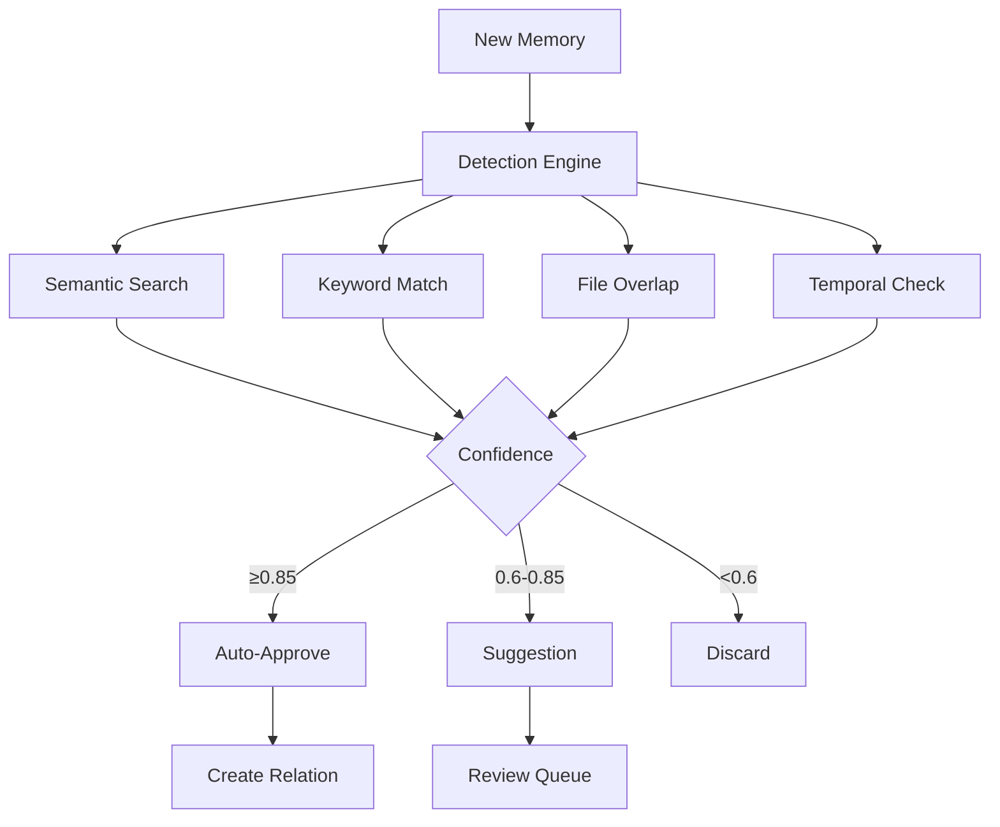

# Relation Detection

Automatically discover relationships between memories using multiple detection strategies. Build your knowledge graph faster with AI-assisted suggestions.

---

## Overview

Instead of manually linking every memory, Doclea's **relation detection** system automatically finds potential connections using:

1. **Semantic similarity** - Vector embeddings find conceptually similar memories
2. **Keyword overlap** - Tag and keyword matching
3. **File overlap** - Memories referencing the same files
4. **Temporal proximity** - Memories created close together



---

## Detection Strategies

### Semantic Similarity

Uses vector embeddings to find conceptually related memories, even without keyword overlap.

```
Memory: "How JWT authentication works"
↓ Vector Search
Found: "OAuth 2.0 token validation patterns"
Similarity: 0.87 (auto-approve)
```

### Keyword Overlap

Matches memories with shared tags or extracted keywords.

```
Memory A: tags ["auth", "security", "jwt"]
Memory B: tags ["jwt", "tokens", "api"]
↓
Overlap: ["jwt"] = 33% match
```

### File Overlap

Finds memories referencing the same source files.

```
Memory A: relatedFiles ["src/auth/jwt.ts"]
Memory B: relatedFiles ["src/auth/jwt.ts", "src/auth/types.ts"]
↓
Overlap: 1 shared file
```

### Temporal Proximity

Detects memories created within a similar time window (default: 7 days).

```
Memory A: created Jan 15 2025
Memory B: created Jan 17 2025
↓
Proximity: 2 days apart = high score
```

---

## Confidence Thresholds

| Threshold | Range | Action |
|-----------|-------|--------|
| **Auto-approve** | ≥0.85 | Relation created immediately |
| **Suggestion** | 0.6-0.85 | Stored for review |
| **Discard** | <0.6 | Not stored |

### Configurable

```json
{
  "semanticThreshold": 0.75,
  "autoApproveThreshold": 0.85,
  "suggestionThreshold": 0.6
}
```

---

## Tools

| Tool | Purpose |
|------|---------|
| [`doclea_detect_relations`](./detect-relations) | Run detection for a memory |
| [`doclea_get_suggestions`](./get-suggestions) | Get pending suggestions |
| [`doclea_review_suggestion`](./review-suggestion) | Approve or reject a suggestion |
| [`doclea_bulk_review`](./bulk-review) | Batch approve/reject suggestions |

---

## Workflow

### 1. Detection Triggers

Detection runs:
- **On memory creation** (if auto-detect enabled)
- **On demand** via `doclea_detect_relations`

### 2. Review Queue

Medium-confidence suggestions go into a review queue:

```json
{
  "suggestions": [
    {
      "id": "sug_abc123",
      "sourceId": "mem_auth_handler",
      "targetId": "mem_jwt_utils",
      "suggestedType": "requires",
      "confidence": 0.78,
      "reason": "Semantic similarity: 78.2%",
      "status": "pending"
    }
  ]
}
```

### 3. Review Actions

- **Approve** - Creates the suggested relation
- **Reject** - Marks suggestion as rejected (won't be suggested again)

### 4. Learning (Future)

Approved/rejected suggestions can train the detection system.

---

## Inferred Relation Types

The detector infers the most likely relation type:

| Pattern | Inferred Type |
|---------|---------------|
| Same domain, newer timestamp | `supersedes` |
| Implementation pattern detected | `implements` |
| Builds upon existing concept | `extends` |
| Clear dependency | `requires` |
| Generic topical match | `related_to` |
| References external resource | `references` |

---

## Integration

### With Memory Storage

Detection can run automatically when storing memories:

```json
// doclea_store with auto-detect
{
  "title": "New Auth Pattern",
  "content": "...",
  "detectRelations": true  // Triggers detection after store
}
```

### With Context Building

Detected relations improve context building by expanding the knowledge graph.

### With Staleness

`supersedes` relations detected automatically trigger staleness on the target.

---

## Performance

| Strategy | Typical Time |
|----------|--------------|
| Semantic | ~100ms |
| Keyword | ~10ms |
| File overlap | ~20ms |
| Temporal | ~10ms |
| **Total** | ~150ms |

All strategies run in **parallel**.

---

## Configuration

### Default Config

```typescript
const DEFAULT_CONFIG = {
  semanticThreshold: 0.75,    // Minimum semantic score
  autoApproveThreshold: 0.85, // Auto-create relations
  suggestionThreshold: 0.6,   // Create suggestions
  temporalWindowDays: 7,      // Temporal proximity window
  maxCandidates: 50,          // Max per strategy
};
```

### Custom Thresholds

```json
// More aggressive auto-approve
{
  "autoApproveThreshold": 0.80
}

// Stricter semantic matching
{
  "semanticThreshold": 0.85
}
```

---

## Best Practices

### Review Regularly

Check the suggestion queue periodically:

```
"Show pending relation suggestions"
```

### Bulk Review

Approve/reject in batches for efficiency:

```
"Approve all suggestions with confidence > 0.8"
```

### Trust Auto-Approve

Relations with ≥0.85 confidence are highly accurate. The auto-approve threshold is intentionally conservative.

### Reject False Positives

Rejecting improves future detection by marking bad patterns.

---

## See Also

- [doclea_link_memories](../relations/link-memories) - Manual linking
- [Memory Relations Overview](../relations/overview)
- [doclea_store](../memory/store) - Store with auto-detect
