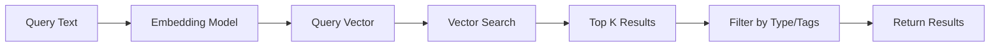

# doclea_search

Semantic search across stored memories. Finds relevant context even without exact keyword matches.

**Category:** Memory
**Status:** Stable

---

## Quick Example

```
"Search memories for authentication patterns"
```

**Response:**

```json
{
  "results": [
    {
      "id": "mem_abc123",
      "title": "JWT Authentication Strategy",
      "type": "decision",
      "score": 0.92,
      "summary": "Using JWT for stateless auth across microservices"
    },
    {
      "id": "mem_def456",
      "title": "OAuth2 Integration Pattern",
      "type": "pattern",
      "score": 0.85,
      "summary": "Standard OAuth2 flow for third-party integrations"
    }
  ],
  "total": 2
}
```

---

## Parameters

### Required

| Parameter | Type | Description |
|-----------|------|-------------|
| `query` | `string` | Natural language search query |

### Optional

| Parameter | Type | Default | Description |
|-----------|------|---------|-------------|
| `type` | `enum` | `null` | Filter by memory type |
| `tags` | `string[]` | `[]` | Filter by tags (OR logic) |
| `limit` | `number` | `10` | Maximum results to return |
| `minScore` | `number` | `0.5` | Minimum similarity score (0-1) |
| `includeContent` | `boolean` | `false` | Include full content in results |

---

## How Search Works



1. Your query is converted to a vector embedding
2. Vector similarity search finds closest matches
3. Results are filtered by type/tags if specified
4. Sorted by relevance score (highest first)

---

## Response Schema

```typescript
interface SearchResponse {
  results: SearchResult[];
  total: number;
  query: string;
}

interface SearchResult {
  id: string;
  title: string;
  type: MemoryType;
  score: number;          // 0-1, higher is more relevant
  summary?: string;
  tags: string[];
  importance: number;
  createdAt: string;
  content?: string;       // Only if includeContent: true
}
```

---

## Usage Examples

### Basic Search

```
"Search memories for database decisions"
```

### Filtered by Type

```
"Search for solutions related to performance"
```

```json
{
  "query": "performance optimization",
  "type": "solution",
  "limit": 5
}
```

### Filtered by Tags

```json
{
  "query": "API design",
  "tags": ["api", "architecture"],
  "minScore": 0.7
}
```

### With Full Content

```json
{
  "query": "authentication flow",
  "includeContent": true,
  "limit": 3
}
```

---

## Search Tips

### Effective Queries

| Query Type | Example | Why It Works |
|------------|---------|--------------|
| **Conceptual** | "handling user authentication" | Matches semantic meaning |
| **Problem-based** | "fixing slow database queries" | Finds solutions |
| **Question-style** | "why did we choose PostgreSQL" | Finds decisions |

### Less Effective Queries

| Query Type | Example | Why It's Weak |
|------------|---------|---------------|
| **Too short** | "auth" | Not enough context |
| **Too specific** | "line 42 of auth.ts" | Code details don't embed well |
| **Negations** | "not using MongoDB" | Vectors don't capture negation |

---

## Understanding Scores

| Score Range | Meaning | Action |
|-------------|---------|--------|
| 0.90+ | Highly relevant, near-exact match | Use directly |
| 0.75-0.90 | Relevant, good context | Review and use |
| 0.60-0.75 | Somewhat related | May be useful |
| 0.50-0.60 | Loosely related | Verify relevance |
| < 0.50 | Not relevant | Ignored by default |

---

## Error Cases

| Error | Cause | Resolution |
|-------|-------|------------|
| `No results found` | No memories match query | Try broader query or lower minScore |
| `Invalid type filter` | Unknown memory type | Use: `decision`, `solution`, `pattern`, `architecture`, `note` |
| `Embedding failed` | Query too long or service unavailable | Shorten query or retry |

---

## Performance

| Scenario | Zero-Config | Docker |
|----------|-------------|--------|
| 100 memories | 20-50ms | 10-20ms |
| 1,000 memories | 50-100ms | 20-30ms |
| 10,000 memories | 100-200ms | 30-50ms |

:::tip Large Collections
For 10k+ memories, use Docker setup with Qdrant for best performance.
:::

---

## Related Tools

| Tool | When to Use |
|------|-------------|
| [`doclea_store`](./store) | Store new memories |
| [`doclea_get`](./get) | Get full details after search |
| [`doclea_update`](./update) | Modify found memories |
| [`doclea_commit_message`](../git/commit-message) | Uses search internally |

---

## See Also

- [Memory Management Guide](../../guides/memory-management)
- [Architecture: Vector Search](../../architecture/vector-search)
