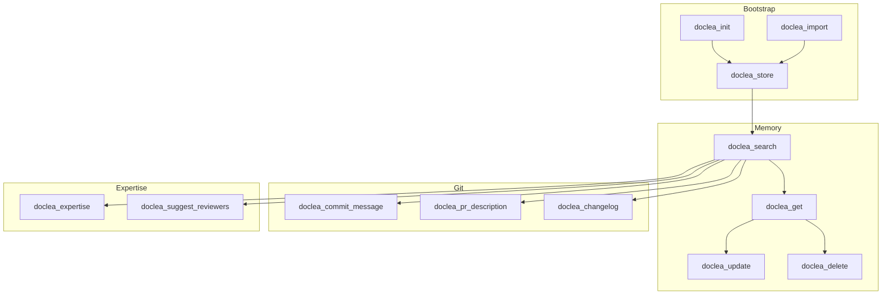

# API Overview

Doclea provides **15 MCP tools** across four categories. Use natural language with Claude, or invoke tools directly.

---

## All Tools at a Glance

### Memory Tools

| Tool | Purpose | Example Prompt |
|------|---------|----------------|
| [`doclea_store`](./memory/store) | Store a new memory | "Store this decision: ..." |
| [`doclea_search`](./memory/search) | Semantic search | "Search memories for auth patterns" |
| [`doclea_get`](./memory/get) | Get by ID | (Used internally) |
| [`doclea_update`](./memory/update) | Modify memory | "Update that memory to add..." |
| [`doclea_delete`](./memory/delete) | Remove memory | "Delete the memory about..." |

### Git Tools

| Tool | Purpose | Example Prompt |
|------|---------|----------------|
| [`doclea_commit_message`](./git/commit-message) | Generate commit | "Generate a commit message" |
| [`doclea_pr_description`](./git/pr-description) | Generate PR description | "Create a PR description" |
| [`doclea_changelog`](./git/changelog) | Generate changelog | "Generate changelog since v1.0" |

### Expertise Tools

| Tool | Purpose | Example Prompt |
|------|---------|----------------|
| [`doclea_expertise`](./expertise/mapping) | Map code ownership | "Who owns the payment module?" |
| [`doclea_suggest_reviewers`](./expertise/reviewers) | Suggest reviewers | "Suggest reviewers for this PR" |

### Bootstrap Tools

| Tool | Purpose | Example Prompt |
|------|---------|----------------|
| [`doclea_init`](./bootstrap/init) | Initialize project | "Initialize doclea for this project" |
| [`doclea_import`](./bootstrap/import) | Import from files | "Import decisions from docs/adr/" |

---

## Memory Types

When storing memories, specify a type:

| Type | Use For | Example |
|------|---------|---------|
| `decision` | Architectural choices | "Using PostgreSQL for ACID" |
| `solution` | Bug fixes, resolutions | "Fixed race condition with mutex" |
| `pattern` | Code conventions | "All API errors use RFC7807" |
| `architecture` | System design | "Service mesh topology" |
| `note` | General documentation | "Team standup is at 10am" |

---

## Common Parameters

These parameters appear across multiple tools:

### `importance` (0-1)

Priority score affecting search ranking.

| Range | Use For |
|-------|---------|
| 0.9-1.0 | Critical architectural decisions |
| 0.7-0.8 | Important patterns/solutions |
| 0.5-0.6 | Standard documentation |
| 0.3-0.4 | Minor notes |
| 0.0-0.2 | Low priority |

### `tags` (string[])

Categories for filtering. Use 2-5 focused tags.

**Good tags:** `auth`, `payments`, `performance`, `security`

**Avoid:** `code`, `feature`, `fix` (too generic)

### `relatedFiles` (string[])

File paths for context. Helps with search relevance.

```json
{
  "relatedFiles": ["src/auth/jwt.ts", "src/middleware/auth.ts"]
}
```

---

## Tool Relationships



---

## Response Format

All tools return MCP-standard responses:

### Success

```json
{
  "content": [{
    "type": "text",
    "text": "{\"id\": \"mem_abc123\", ...}"
  }]
}
```

### Error

```json
{
  "content": [{
    "type": "text",
    "text": "Error: Memory not found"
  }],
  "isError": true
}
```

---

## Performance

| Operation | Zero-Config | Docker |
|-----------|-------------|--------|
| First embedding | 2-5s | &lt;100ms |
| Store memory | 100-250ms | 50-100ms |
| Search (10k memories) | 50-200ms | 20-50ms |
| Generate commit | 200-500ms | 100-200ms |

---

## Next Steps

- [doclea_store](./memory/store) - Store your first memory
- [doclea_search](./memory/search) - Find relevant context
- [doclea_init](./bootstrap/init) - Bootstrap a new project
