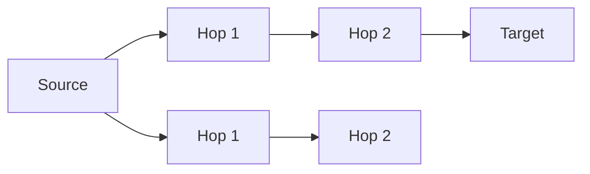

# doclea_find_path

Find the shortest path between two memories in the knowledge graph. Uses breadth-first search to discover how memories connect.

**Category:** Memory Relations
**Status:** Stable

---

## Quick Example

```
"How is the login handler connected to the database schema?"
```

**Response:**

```json
{
  "path": [
    "mem_login_handler",
    "mem_auth_service",
    "mem_user_repository",
    "mem_db_schema"
  ],
  "message": "Found path with 4 steps"
}
```

---

## Parameters

| Parameter | Type | Required | Default | Description |
|-----------|------|----------|---------|-------------|
| `sourceId` | `string` | Yes | - | Starting memory ID |
| `targetId` | `string` | Yes | - | Target memory ID |
| `maxDepth` | `number` | No | `5` | Maximum path length (1-10) |

---

## Usage Examples

### Basic Path Finding

```
"Find connection between auth memory and crypto memory"
```

```json
{
  "sourceId": "mem_auth_flow",
  "targetId": "mem_crypto_utils"
}
```

### With Depth Limit

```
"Find short path (max 3 hops) between these memories"
```

```json
{
  "sourceId": "mem_api_handler",
  "targetId": "mem_logger",
  "maxDepth": 3
}
```

### Deep Search

```
"Find any connection up to 10 hops"
```

```json
{
  "sourceId": "mem_frontend_component",
  "targetId": "mem_backend_service",
  "maxDepth": 10
}
```

---

## Response Schema

```typescript
interface FindPathResult {
  path: string[] | null;    // Array of memory IDs, or null if no path
  message: string;
}
```

### Path Found

```json
{
  "path": ["mem_a", "mem_b", "mem_c", "mem_d"],
  "message": "Found path with 4 steps"
}
```

### No Path

```json
{
  "path": null,
  "message": "No path found between memories"
}
```

---

## How It Works

### Breadth-First Search (BFS)

The algorithm uses BFS to find the **shortest path**:

1. Start at source memory
2. Explore all direct connections (depth 1)
3. Explore their connections (depth 2)
4. Continue until target found or maxDepth reached



### Directionality

Path finding follows **outgoing** relationships only:

- A → B → C → D (valid path)
- A ← B (not followed)

This ensures paths represent logical flow (dependencies, references).

---

## Visualization

Path result can be visualized:

```
mem_login_handler
    │ requires
    ▼
mem_auth_service
    │ references
    ▼
mem_user_repository
    │ implements
    ▼
mem_db_schema
```

---

## Use Cases

### Understanding Connections

```
"How does the frontend connect to the database layer?"
```

Reveals the chain of dependencies and references.

### Debugging Dependencies

```
"Why does changing X affect Y?"
```

The path shows the chain of relationships.

### Architecture Validation

```
"Should these two components be connected?"
```

- Path found = connected (possibly unexpectedly)
- No path = isolated (possibly by design)

### Documentation Navigation

```
"How do I get from feature A to feature B?"
```

Shows the conceptual path through documentation.

---

## Depth Guidelines

| maxDepth | Use Case |
|----------|----------|
| 2-3 | Tightly coupled components |
| 4-5 | Default, most use cases |
| 6-8 | Loosely coupled systems |
| 9-10 | Finding any connection |

### Performance

| maxDepth | Typical Time |
|----------|--------------|
| 3 | ~10ms |
| 5 | ~50ms |
| 7 | ~200ms |
| 10 | ~1s |

---

## No Path Scenarios

No path is returned when:

1. **No connection exists** - Memories are in disconnected subgraphs
2. **Depth limit reached** - Path exists but is longer than maxDepth
3. **Wrong direction** - Path exists but in opposite direction

### Troubleshooting No Path

```
// Try increasing depth
{ "maxDepth": 10 }

// Try swapping source/target (reverse direction)
{ "sourceId": "mem_b", "targetId": "mem_a" }

// Check if memories exist
doclea_get_memory({ "id": "mem_a" })
```

---

## Comparison with get_related

| Tool | Purpose | Returns |
|------|---------|---------|
| `doclea_find_path` | Specific path A→B | Single path |
| `doclea_get_related` | All connections | Full graph |

Use `find_path` when you know both endpoints.
Use `get_related` for exploration.

---

## Error Cases

| Error | Cause | Resolution |
|-------|-------|------------|
| `Source memory not found` | Invalid sourceId | Verify memory exists |
| `Target memory not found` | Invalid targetId | Verify memory exists |
| `Invalid maxDepth` | Depth < 1 or > 10 | Use valid depth |

---

## Example Paths

### Direct Connection

```json
{
  "path": ["mem_a", "mem_b"],
  "message": "Found path with 2 steps"
}
```

### Through Intermediaries

```json
{
  "path": ["mem_a", "mem_x", "mem_y", "mem_b"],
  "message": "Found path with 4 steps"
}
```

### Long Chain

```json
{
  "path": ["mem_ui", "mem_controller", "mem_service", "mem_repo", "mem_db"],
  "message": "Found path with 5 steps"
}
```

---

## See Also

- [doclea_get_related](./get-related) - Explore all connections
- [doclea_link_memories](./link-memories) - Create relationships
- [Memory Relations Overview](./overview)
