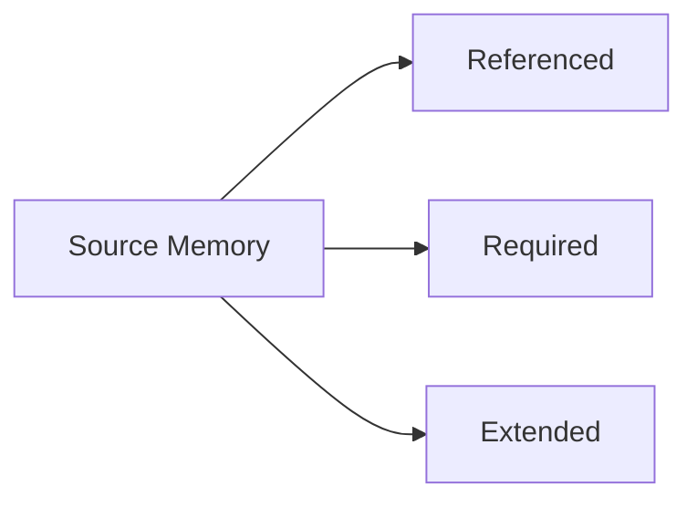
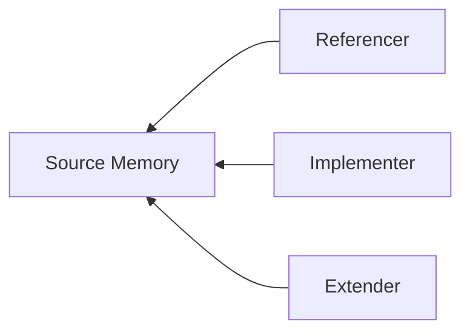
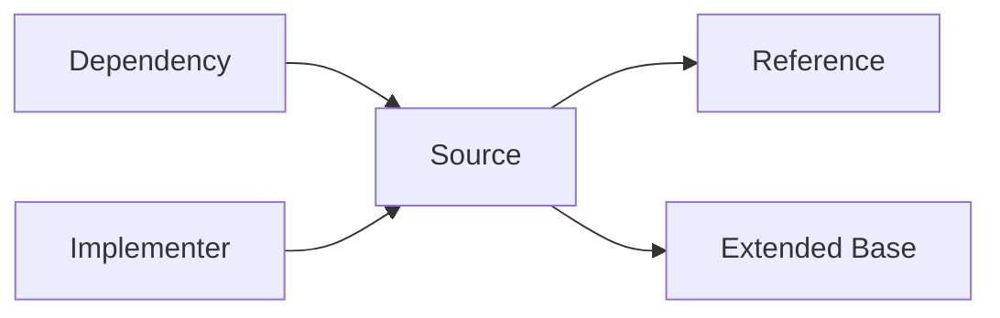

# doclea_get_related

Find memories related to a given memory through graph traversal. Explores the knowledge graph to discover connected memories.

**Category:** Memory Relations
**Status:** Stable

---

## Quick Example

```
"What memories are related to the authentication flow?"
```

**Response:**

```json
{
  "related": [
    {
      "memoryId": "mem_jwt_service",
      "depth": 1,
      "relationPath": ["requires"]
    },
    {
      "memoryId": "mem_user_model",
      "depth": 1,
      "relationPath": ["references"]
    },
    {
      "memoryId": "mem_session_handler",
      "depth": 2,
      "relationPath": ["requires", "extends"]
    }
  ],
  "graph": {
    "nodes": [
      { "id": "mem_auth_flow", "depth": 0 },
      { "id": "mem_jwt_service", "depth": 1 },
      { "id": "mem_user_model", "depth": 1 },
      { "id": "mem_session_handler", "depth": 2 }
    ],
    "edges": [
      { "sourceId": "mem_auth_flow", "targetId": "mem_jwt_service", "type": "requires" },
      { "sourceId": "mem_auth_flow", "targetId": "mem_user_model", "type": "references" },
      { "sourceId": "mem_jwt_service", "targetId": "mem_session_handler", "type": "extends" }
    ]
  },
  "message": "Found 3 related memories (4 relationships)"
}
```

---

## Parameters

| Parameter | Type | Required | Default | Description |
|-----------|------|----------|---------|-------------|
| `memoryId` | `string` | Yes | - | Memory ID to find relations for |
| `depth` | `number` | No | `2` | How many hops to traverse (1-5) |
| `relationTypes` | `string[]` | No | All types | Filter by relation types |
| `direction` | `string` | No | `"both"` | `"outgoing"`, `"incoming"`, or `"both"` |

---

## Usage Examples

### Find All Related

```
"Show me everything connected to the database module documentation"
```

```json
{
  "memoryId": "mem_db_module",
  "depth": 2,
  "direction": "both"
}
```

### Outgoing Only

```
"What does the API handler depend on?"
```

```json
{
  "memoryId": "mem_api_handler",
  "direction": "outgoing",
  "depth": 3
}
```

### Incoming Only

```
"What depends on the utils library?"
```

```json
{
  "memoryId": "mem_utils_lib",
  "direction": "incoming",
  "depth": 2
}
```

### Filter by Type

```
"Find all memories that this pattern implements"
```

```json
{
  "memoryId": "mem_repository_pattern",
  "direction": "incoming",
  "relationTypes": ["implements"]
}
```

### Deep Traversal

```
"Explore the full knowledge graph around authentication"
```

```json
{
  "memoryId": "mem_auth",
  "depth": 4,
  "direction": "both"
}
```

---

## Response Schema

```typescript
interface GetRelatedResult {
  related: RelatedMemory[];
  graph: MemoryGraph;
  message: string;
}

interface RelatedMemory {
  memoryId: string;           // Related memory ID
  depth: number;              // Distance from source
  relationPath: string[];     // Relation types in path
}

interface MemoryGraph {
  nodes: Array<{
    id: string;
    depth: number;
  }>;
  edges: Array<{
    sourceId: string;
    targetId: string;
    type: string;
    weight: number;
  }>;
}
```

---

## Direction Options

### `"outgoing"` - Dependencies

What does this memory reference/require/extend?



### `"incoming"` - Dependents

What references/requires/extends this memory?



### `"both"` - Full Graph

Explore in all directions (default):



---

## Depth Control

| Depth | Coverage | Use Case |
|-------|----------|----------|
| 1 | Direct connections only | Quick lookup |
| 2 | +1 level of indirect | Default, balanced |
| 3 | Broader exploration | Understanding context |
| 4-5 | Deep traversal | Full graph analysis |

**Example at depth 2:**

```
auth_handler → jwt_service → crypto_utils
            ↑ depth 1      ↑ depth 2
```

---

## Graph Visualization

The response includes a graph structure suitable for visualization:

```
mem_api_handler (depth 0)
├── OUTGOING:
│   ├── mem_auth_service (depth 1) [requires]
│   │   ├── mem_jwt_utils (depth 2) [requires]
│   │   └── mem_user_store (depth 2) [references]
│   └── mem_logger (depth 1) [references]
│
└── INCOMING:
    ├── mem_route_handler (depth 1) [extends]
    └── mem_admin_api (depth 1) [extends]
```

---

## Filtering by Type

### Single Type

```json
{
  "memoryId": "mem_interface",
  "relationTypes": ["implements"],
  "direction": "incoming"
}
```

Returns only memories that implement this interface.

### Multiple Types

```json
{
  "memoryId": "mem_base",
  "relationTypes": ["implements", "extends"],
  "direction": "incoming"
}
```

Returns memories that implement OR extend the base.

---

## Use Cases

### Understanding Dependencies

```
"What does the payment service depend on?"
```

```json
{
  "memoryId": "mem_payment_service",
  "direction": "outgoing",
  "depth": 2
}
```

### Impact Analysis

```
"What would be affected if I change the user model?"
```

```json
{
  "memoryId": "mem_user_model",
  "direction": "incoming",
  "depth": 3
}
```

### Finding Implementations

```
"What implements the IRepository pattern?"
```

```json
{
  "memoryId": "mem_irepository",
  "direction": "incoming",
  "relationTypes": ["implements"]
}
```

### Context Gathering

```
"Get full context around this feature"
```

```json
{
  "memoryId": "mem_feature_x",
  "direction": "both",
  "depth": 3
}
```

---

## Performance

| Depth | Typical Nodes | Time |
|-------|---------------|------|
| 1 | 3-10 | ~5ms |
| 2 | 10-50 | ~20ms |
| 3 | 30-200 | ~100ms |
| 4-5 | 100-1000+ | ~500ms |

**Tip:** Start with depth 2, increase if needed.

---

## Error Cases

| Error | Cause | Resolution |
|-------|-------|------------|
| `Memory not found` | Invalid memoryId | Verify memory exists |
| `Invalid depth` | Depth < 1 or > 5 | Use valid depth |
| `Invalid relation type` | Unknown type in filter | Check relation types |

---

## See Also

- [doclea_link_memories](./link-memories) - Create relationships
- [doclea_find_path](./find-path) - Find paths between memories
- [Memory Relations Overview](./overview)
