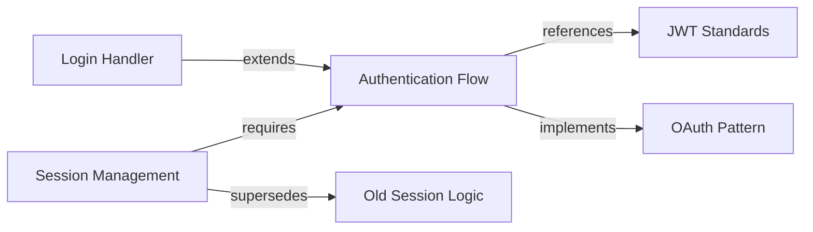

# Memory Relations

Build a knowledge graph by linking memories with typed relationships. Navigate and query connections between your documented knowledge.

---

## Overview

Memories in Doclea can be connected through **typed relationships**. This creates a navigable knowledge graph that enables:

- **Relationship discovery** - Find how memories connect
- **Path finding** - Trace connections between distant memories
- **Impact analysis** - Understand what depends on what
- **Context enrichment** - Pull in related knowledge automatically



---

## Relation Types

| Type | Direction | Use Case |
|------|-----------|----------|
| `references` | A → B | Generic reference, A mentions B |
| `implements` | A → B | A is an implementation of pattern B |
| `extends` | A → B | A builds upon or extends B |
| `related_to` | A ↔ B | Loose topical relationship |
| `supersedes` | A → B | A replaces or updates B |
| `requires` | A → B | A depends on B |

### Semantic Meanings

**`references`** - The most common type. Use when one memory cites, mentions, or links to another without a stronger semantic relationship.

**`implements`** - For concrete implementations of abstract patterns. E.g., "PostgreSQL Repository" implements "Repository Pattern".

**`extends`** - For memories that build upon others. E.g., "Advanced Auth" extends "Basic Auth".

**`related_to`** - For loose associations. Use when memories share topics but don't have a directional relationship.

**`supersedes`** - For versioning and updates. The newer memory supersedes the older one. Triggers staleness detection.

**`requires`** - For dependencies. A requires B to function or make sense.

---

## Tools

| Tool | Purpose |
|------|---------|
| [`doclea_link_memories`](./link-memories) | Create a relationship between two memories |
| [`doclea_get_related`](./get-related) | Find related memories with graph traversal |
| [`doclea_find_path`](./find-path) | Find shortest path between two memories |
| [`doclea_delete_relation`](./delete-relation) | Remove a relationship |

---

## Relationship Weights

Relationships have a **weight** (0-1) indicating strength:

| Weight | Meaning |
|--------|---------|
| 1.0 | Strong, definite relationship |
| 0.7-0.9 | Clear relationship |
| 0.4-0.6 | Moderate relationship |
| 0.1-0.3 | Weak or tentative relationship |

Weights affect:
- Graph traversal ordering (higher weights first)
- Relation-aware scoring
- Context building prioritization

---

## Graph Structure

### Nodes
Every memory is a potential node in the graph.

### Edges
Relationships are **directed edges** with:
- Source memory ID
- Target memory ID
- Relation type
- Weight
- Optional metadata

### Traversal
The graph can be traversed:
- **Outgoing** - Follow edges from a memory
- **Incoming** - Follow edges to a memory
- **Both** - Bidirectional traversal

---

## Integration

### With Context Building

Related memories can be automatically included in context:

```
"Get context for the login handler, include related patterns"
```

The system follows relationships to pull in connected knowledge.

### With Staleness Detection

`supersedes` relationships trigger staleness detection - if A supersedes B, B is marked as stale.

### With Semantic Search

Relations influence search result ranking through relation-aware boost factors.

---

## Common Patterns

### Documentation Hierarchy

```
Architecture Decision
├── implements → Specific Implementation
├── references → External Standard
└── supersedes → Previous Decision
```

### Feature Documentation

```
Feature Memory
├── requires → Dependency Memory
├── related_to → Related Feature
└── extends → Base Feature
```

### Knowledge Evolution

```
v2 API Documentation
└── supersedes → v1 API Documentation
                  └── supersedes → v0 API Documentation
```

---

## Best Practices

### When to Link

| Scenario | Relation Type |
|----------|---------------|
| New memory cites existing one | `references` |
| Concrete implementation of pattern | `implements` |
| Updated version of existing memory | `supersedes` |
| Memory needs another to make sense | `requires` |
| Topics overlap but no direction | `related_to` |
| Building on top of foundation | `extends` |

### Avoid

- Creating too many `related_to` links (prefer specific types)
- Circular `requires` chains
- Multiple `supersedes` for the same memory
- Links without meaningful semantic value

---

## Database Schema

Relationships are stored in `memory_relations`:

```sql
CREATE TABLE memory_relations (
  id TEXT PRIMARY KEY,
  source_id TEXT NOT NULL,
  target_id TEXT NOT NULL,
  type TEXT NOT NULL,
  weight REAL DEFAULT 1.0,
  metadata TEXT,
  created_at INTEGER NOT NULL,
  UNIQUE(source_id, target_id, type)
);
```

---

## See Also

- [doclea_context](../context/overview) - Context building with relations
- [doclea_staleness](../memory/staleness) - Staleness detection using supersedes
- [Relation Detection](../detection/overview) - Auto-detect potential relations
