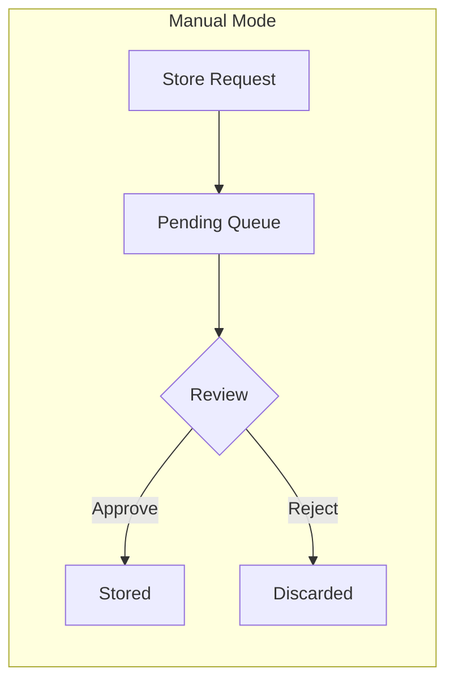
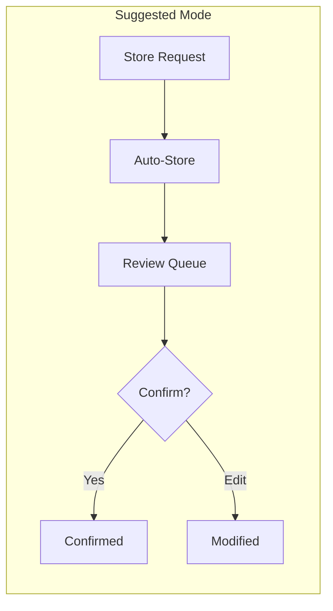
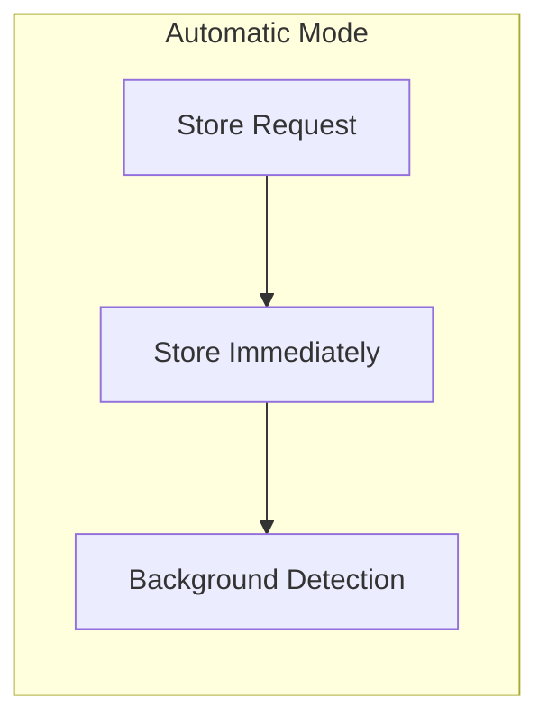

# Storage Modes & Approval Workflow

Control how memories are stored with different approval workflows. Choose between manual review, suggested storage with approval, or fully automatic storage.

---

## Overview

Doclea supports three **storage modes** that control how memories flow from creation to permanent storage:







---

## Storage Modes

### `manual` Mode

**All memories require explicit approval before storage.**

| Step | Action |
|------|--------|
| 1 | `doclea_store` creates pending memory |
| 2 | Memory sits in pending queue |
| 3 | User calls `doclea_approve_pending` or `doclea_reject_pending` |
| 4 | Approved memories stored to SQLite + vectors |

**Best for:** High-quality curated knowledge bases

### `suggested` Mode

**Memories are stored but flagged for review.**

| Step | Action |
|------|--------|
| 1 | `doclea_store` stores immediately |
| 2 | Memory marked as "needs review" |
| 3 | User reviews via `doclea_review_queue` |
| 4 | User confirms or modifies via `doclea_confirm_memory` |

**Best for:** Balanced workflow with quality gates

### `automatic` Mode

**Memories are stored immediately without review.**

| Step | Action |
|------|--------|
| 1 | `doclea_store` stores immediately |
| 2 | Relation detection runs in background |
| 3 | No review required |

**Best for:** Fast capture, bulk imports

---

## Tools

| Tool | Purpose |
|------|---------|
| [`doclea_set_storage_mode`](./set-storage-mode) | Change storage mode |
| [`doclea_get_storage_mode`](./get-storage-mode) | Get current mode |
| [`doclea_list_pending`](./list-pending) | List pending memories |
| [`doclea_approve_pending`](./approve-pending) | Approve a pending memory |
| [`doclea_reject_pending`](./reject-pending) | Reject a pending memory |
| [`doclea_bulk_approve`](./bulk-approve-pending) | Bulk approve pending |
| [`doclea_bulk_reject`](./bulk-reject-pending) | Bulk reject pending |
| [`doclea_review_queue`](./review-queue) | Get memories needing review |
| [`doclea_confirm_memory`](./confirm-memory) | Confirm an auto-stored memory |

---

## Pending Memory Flow

### In Manual Mode

```
1. doclea_store() → Pending created
2. doclea_list_pending() → See pending
3. doclea_approve_pending(pendingId) → Stored
   OR
   doclea_reject_pending(pendingId) → Discarded
```

### What Happens on Approve

1. **Apply modifications** - Optional title/content/tags changes
2. **Generate embedding** - Create vector for semantic search
3. **Store to vectors** - Add to Qdrant
4. **Store to SQLite** - Add to memories table
5. **Delete pending** - Remove from pending queue
6. **Detect relations** - Background relation detection

### Pending Memory Structure

```typescript
interface PendingMemory {
  id: string;              // Pending memory ID
  memoryData: {            // The memory to be stored
    id: string;
    title: string;
    content: string;
    type: string;
    tags?: string[];
    relatedFiles?: string[];
    importance?: number;
  };
  createdAt: number;       // When pending was created
  source: string;          // "user" or "ai"
}
```

---

## Review Queue Flow

### In Suggested/Automatic Mode

```
1. doclea_store() → Stored immediately
2. doclea_review_queue() → See stored but unconfirmed
3. doclea_confirm_memory(memoryId) → Mark as reviewed
```

### Review Queue Purpose

- Quality assurance for auto-stored memories
- Opportunity to modify before finalizing
- Track which memories have been human-verified

---

## Mode Comparison

| Aspect | Manual | Suggested | Automatic |
|--------|--------|-----------|-----------|
| Store speed | Delayed | Immediate | Immediate |
| Quality control | Full | Optional | None |
| Review required | Yes | Recommended | No |
| Best for | Curated KB | Balanced | Bulk import |
| Vectors stored | On approve | On store | On store |

---

## Common Workflows

### Quality-First

```typescript
// 1. Use manual mode
setStorageMode("manual");

// 2. Store creates pending
await store({ title: "...", content: "..." });

// 3. Review pending
const pending = listPending();

// 4. Approve good ones with modifications
await approvePending({
  pendingId: pending[0].id,
  tags: ["refined", "tags"]
});

// 5. Reject bad ones
rejectPending({ pendingId: pending[1].id });
```

### Speed-First

```typescript
// 1. Use automatic mode
setStorageMode("automatic");

// 2. Store immediately
await store({ title: "...", content: "..." });
// Memory is stored, relations detected in background

// 3. Optional: review later
const queue = reviewQueue({ limit: 10 });
for (const memory of queue) {
  confirmMemory({ memoryId: memory.id });
}
```

### Bulk Import

```typescript
// 1. Use automatic mode for speed
setStorageMode("automatic");

// 2. Import many memories
for (const doc of documents) {
  await store(doc);
}

// 3. Switch back to manual for ongoing work
setStorageMode("manual");
```

---

## Approval with Modifications

When approving, you can modify the memory:

```json
{
  "pendingId": "pending_abc123",
  "title": "Better Title",
  "tags": ["refined", "reviewed"],
  "type": "decision"
}
```

Original pending content is preserved until approve/reject.

---

## Error Handling

### Approval Failures

If approval fails (e.g., embedding error):
- Pending memory is **not deleted**
- User can retry approval
- Error message returned

### Vector Store Issues

If vector store is unavailable:
- Manual mode: Approval blocked
- Automatic mode: Store continues without vectors

---

## Configuration

### Default Mode

Set in configuration:

```json
{
  "storageMode": "suggested"
}
```

### Runtime Change

```json
// doclea_set_storage_mode
{ "mode": "manual" }
```

---

## Best Practices

### For Knowledge Bases

Use **manual mode** for curated, high-quality content.

### For Development

Use **suggested mode** for balance between speed and quality.

### For Imports

Switch to **automatic mode** temporarily for bulk imports, then switch back.

### Review Regularly

In suggested mode, regularly clear the review queue:

```json
{ "limit": 50 }
```

---

## See Also

- [doclea_store](../memory/store) - Store memories
- [doclea_search](../memory/search) - Search memories
- [Relation Detection](../detection/overview) - Auto-detected relations
