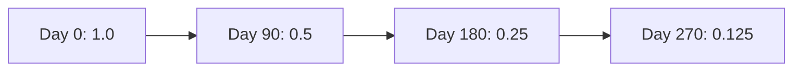
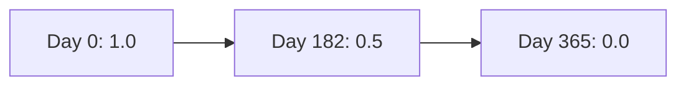
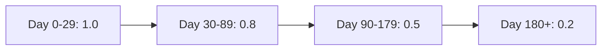

# Confidence Decay

Confidence decay automatically reduces a memory's effective relevance over time, ensuring fresh knowledge surfaces above stale information in search results.

---

## Why Decay Matters

Not all knowledge ages equally:

| Knowledge Type | Decay Appropriate? |
|---------------|-------------------|
| Yesterday's bug fix | ✅ Yes - patterns change |
| Last year's framework choice | ⚠️ Maybe - might be outdated |
| Core architecture decision | ❌ No - foundational, stable |

Without decay, old memories with high importance scores would forever outrank newer, potentially more relevant context.

---

## How It Works

### The Decay Formula

Confidence decay transforms a memory's **importance** into an **effective confidence** score:

```
effectiveConfidence = importance × decayFactor(age)
```

Where `decayFactor` is a time-based function that returns values from 1.0 (no decay) to 0.0 (fully decayed).

### Decay Functions

Doclea supports three decay functions:

#### Exponential (Default)



**Formula:** `decayFactor = 0.5^(age / halfLifeDays)`

**Best for:** General-purpose decay where recent memories should dominate.

**Configuration:**
```typescript
decay: {
  type: "exponential",
  halfLifeDays: 90  // Score halves every 90 days
}
```

#### Linear



**Formula:** `decayFactor = max(0, 1 - age / fullDecayDays)`

**Best for:** Predictable, steady decline over a fixed period.

**Configuration:**
```typescript
decay: {
  type: "linear",
  fullDecayDays: 365  // Reaches floor after 1 year
}
```

#### Step



**Best for:** Discrete phases like "fresh → stale → archive-worthy".

**Configuration:**
```typescript
decay: {
  type: "step",
  thresholds: [
    { days: 30, score: 0.8 },
    { days: 90, score: 0.5 },
    { days: 180, score: 0.2 }
  ]
}
```

---

## Decay Anchor

The decay calculation needs a starting point. Doclea uses this priority:

| Priority | Field | Description |
|----------|-------|-------------|
| 1 | `lastRefreshedAt` | Explicit refresh via `doclea_staleness` |
| 2 | `accessedAt` | When memory was last retrieved (if `refreshOnAccess: true`) |
| 3 | `createdAt` | Original creation timestamp |

### Virtual Refresh on Access

When `refreshOnAccess: true` (default), accessing a memory in search results resets its decay anchor **virtually** - the age calculation uses `accessedAt`, but no database write occurs.

This means frequently-used memories naturally maintain relevance.

---

## Decay Floor

The `floor` setting prevents memories from becoming completely irrelevant:

```typescript
floor: 0.1  // Decayed score never goes below 10%
```

Even a 5-year-old memory with importance 1.0 will have effective confidence ≥ 0.1.

---

## Exemptions

Some memories should never decay:

### By Memory Type

```typescript
exemptTypes: ["architecture"]
```

Architecture decisions are foundational and shouldn't lose relevance over time.

### By Tag

```typescript
exemptTags: ["pinned", "evergreen"]
```

Tag memories as `pinned` to protect them from decay.

### Per-Memory Override

Individual memories can override global decay settings:

| Field | Effect |
|-------|--------|
| `decayRate: 0` | Pinned - no decay |
| `decayRate: 2` | Decays twice as fast |
| `decayFunction: "none"` | Exempt from decay |
| `confidenceFloor: 0.5` | Custom floor for this memory |

---

## Configuration

### Full Example

```typescript
scoring: {
  enabled: true,
  confidenceDecay: {
    enabled: true,
    decay: {
      type: "exponential",
      halfLifeDays: 90
    },
    floor: 0.1,
    refreshOnAccess: true,
    exemptTypes: ["architecture"],
    exemptTags: ["pinned", "evergreen"]
  }
}
```

### Recommended Presets

| Preset | halfLifeDays | floor | Use Case |
|--------|-------------|-------|----------|
| **Aggressive** | 30 | 0.1 | Fast-moving projects |
| **Balanced** | 90 | 0.1 | Most projects |
| **Conservative** | 180 | 0.2 | Stable, mature codebases |

---

## Integration with Staleness

Confidence decay and [staleness detection](/docs/guides/memory-staleness) are complementary:

| Feature | Purpose |
|---------|---------|
| **Confidence Decay** | Automatically reduces search ranking |
| **Staleness Detection** | Identifies memories needing human review |

Both use similar anchor logic (`lastRefreshedAt` → `accessedAt` → `createdAt`).

When you refresh a memory via `doclea_staleness`:
1. `lastRefreshedAt` is updated
2. Decay anchor resets
3. Effective confidence returns to full importance

---

## Search Impact

Confidence decay affects the **confidence** factor in multi-factor scoring:

```
finalScore = semantic × 0.5 + recency × 0.2 + confidence × 0.15 + frequency × 0.15
```

With decay enabled, the `confidence` component uses `effectiveConfidence` instead of raw `importance`.

### Example Impact

Memory with importance 1.0, accessed 180 days ago:

| Decay Setting | Effective Confidence | Search Impact |
|---------------|---------------------|---------------|
| Disabled | 1.0 | Full ranking |
| Exponential (90d half-life) | 0.25 | Reduced ranking |
| Linear (365d full decay) | 0.51 | Moderate reduction |

---

## Caching

Decay calculations are cached for performance:

- **TTL:** 60 seconds
- **Max entries:** 1000
- **Auto-prune:** Entries evicted when cache exceeds 1000

The cache key includes the memory ID and anchor timestamp, so refreshing a memory invalidates its cache entry.

---

## Best Practices

### Do

- **Enable decay** for active projects with frequent new knowledge
- **Use `refreshOnAccess: true`** to keep frequently-used memories relevant
- **Exempt architectural decisions** - they're foundational
- **Run regular staleness scans** to refresh verified memories

### Don't

- **Enable decay without staleness detection** - you lose visibility into what's decaying
- **Set floor too low** (< 0.1) - memories become unfindable
- **Set halfLifeDays too short** (< 30) - memories decay before they're useful
- **Exempt everything** - defeats the purpose

---

## Troubleshooting

### Memories Disappearing from Search

**Symptom:** Known memories not appearing in results

**Causes:**
1. Decayed below relevance threshold
2. High-importance recent memories outranking

**Solution:**
- Check effective confidence: `doclea_get` shows `effectiveConfidence`
- Refresh the memory: `doclea_staleness` with `action: refresh`
- Add `pinned` tag to exempt from decay

### Decay Not Working

**Symptom:** Old memories still have full confidence

**Causes:**
1. Decay disabled (`confidenceDecay.enabled: false`)
2. Memory type exempt
3. Memory has `pinned` tag
4. Memory has `decayRate: 0`

**Solution:** Check configuration and memory metadata.

### Too Aggressive Decay

**Symptom:** Useful memories losing relevance too quickly

**Solutions:**
- Increase `halfLifeDays` (e.g., 90 → 180)
- Increase `floor` (e.g., 0.1 → 0.2)
- Enable `refreshOnAccess: true`
- Add frequently-needed memories to `exemptTags`

---

## See Also

- [Memory Staleness Guide](/docs/guides/memory-staleness)
- [Retrieval Strategies](/docs/architecture/retrieval-strategies)
- [Scoring Configuration](/docs/configuration)
