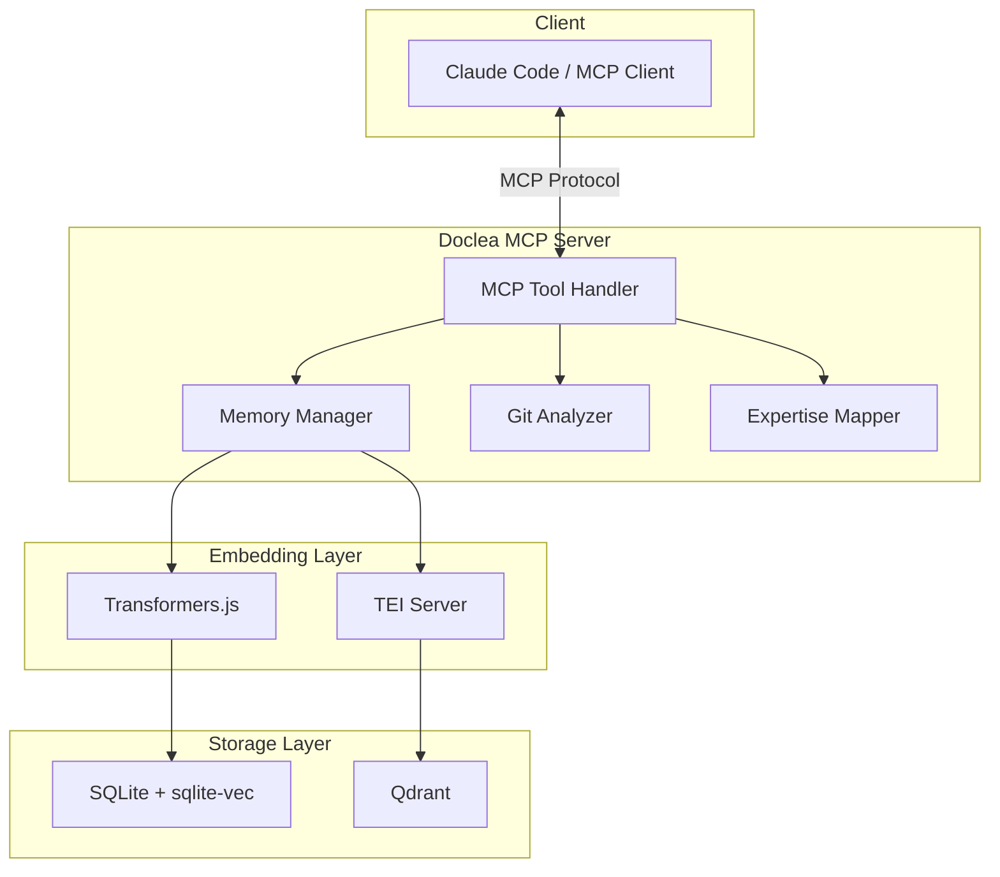
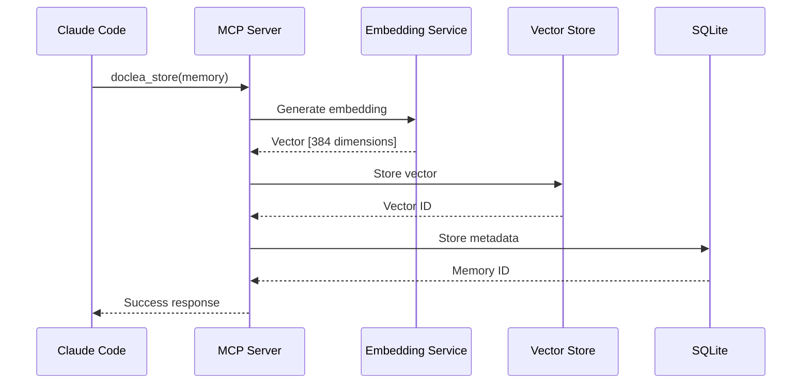
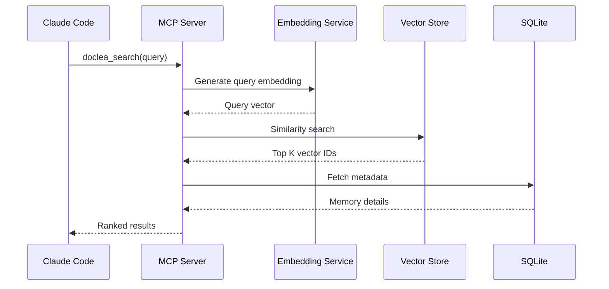
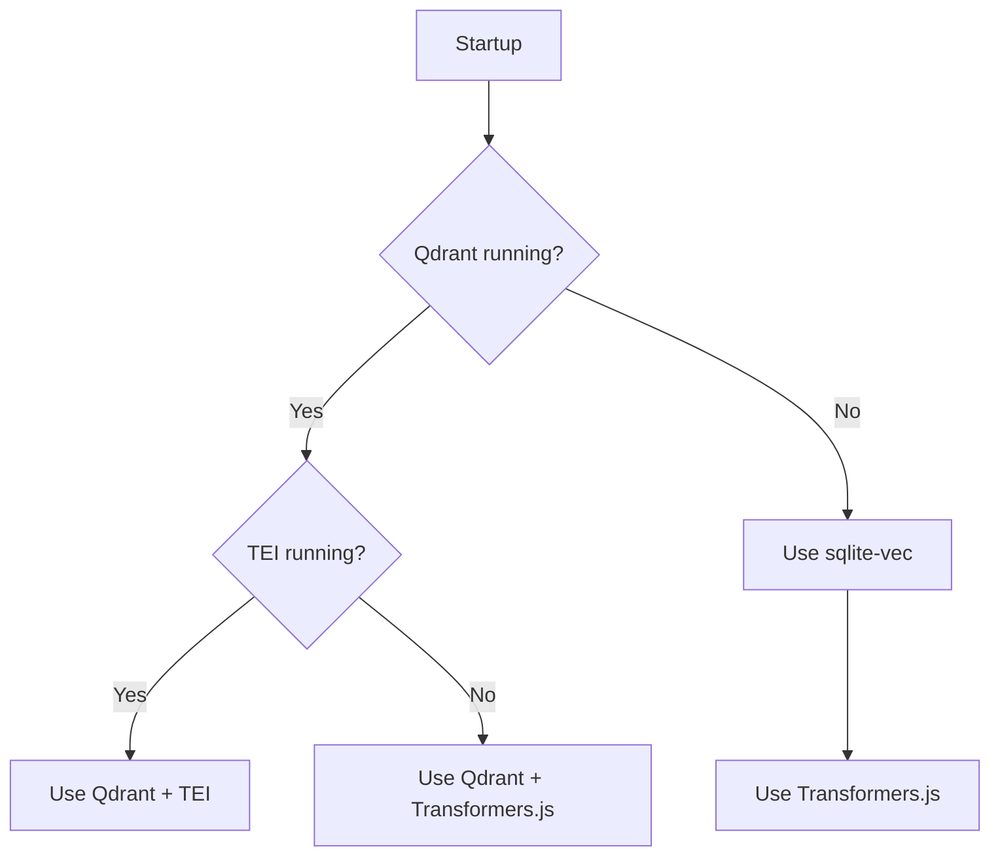

# Architecture Overview

Understand how Doclea stores, embeds, and searches your project memories.

---

## High-Level Architecture



---

## Components

### MCP Server

Doclea implements the [Model Context Protocol](https://modelcontextprotocol.io/) (MCP), enabling any compatible AI assistant to use its tools.

**Key characteristics:**
- Stateless request/response
- JSON-RPC 2.0 transport
- Tool-based interface (15 tools)

### Embedding Layer

Converts text to vectors for semantic search.

| Provider | Setup | Performance | Best For |
|----------|-------|-------------|----------|
| **Transformers.js** | Zero-config | ~200ms/embed | Development, small projects |
| **TEI (Docker)** | Requires Docker | ~20ms/embed | Production, large codebases |

### Vector Storage

Stores and searches vector embeddings.

| Store | Setup | Capacity | Best For |
|-------|-------|----------|----------|
| **sqlite-vec** | Zero-config | ~50k vectors | Single user, local |
| **Qdrant** | Docker | Millions | Teams, large scale |

### Metadata Storage

SQLite database for structured data:

```sql
-- Core tables
memories (id, type, title, content, importance, ...)
tags (memory_id, tag)
related_files (memory_id, file_path)
experts (memory_id, expert)
```

---

## Data Flow

### Storing a Memory



### Searching Memories



---

## Auto-Detection

Doclea automatically selects the best available backend:



**Detection order:**
1. Check `localhost:6333` for Qdrant
2. Check `localhost:8080` for TEI
3. Fall back to embedded sqlite-vec + Transformers.js

---

## File Structure

```
your-project/
├── .doclea/
│   ├── local.db          # SQLite: metadata + sqlite-vec vectors
│   └── config.json       # Optional: override auto-detection
├── src/
└── ...
```

### Database Schema

```sql
CREATE TABLE memories (
    id TEXT PRIMARY KEY,
    qdrant_id TEXT,
    type TEXT NOT NULL,
    title TEXT NOT NULL,
    content TEXT NOT NULL,
    summary TEXT,
    importance REAL DEFAULT 0.5,
    git_commit TEXT,
    source_pr TEXT,
    created_at TEXT NOT NULL,
    updated_at TEXT NOT NULL
);

CREATE TABLE memory_tags (
    memory_id TEXT REFERENCES memories(id),
    tag TEXT NOT NULL
);

CREATE TABLE memory_files (
    memory_id TEXT REFERENCES memories(id),
    file_path TEXT NOT NULL
);

CREATE TABLE memory_experts (
    memory_id TEXT REFERENCES memories(id),
    expert TEXT NOT NULL
);
```

---

## Embedding Models

### Default: all-MiniLM-L6-v2

- **Dimensions:** 384
- **Size:** ~90MB
- **Context:** 256 tokens
- **Performance:** Good general-purpose semantic similarity

### Alternative Models

Configure in `.doclea/config.json`:

```json
{
  "embedding": {
    "provider": "openai",
    "model": "text-embedding-3-small"
  }
}
```

| Model | Dimensions | Best For |
|-------|------------|----------|
| all-MiniLM-L6-v2 | 384 | General purpose (default) |
| text-embedding-3-small | 1536 | Higher accuracy |
| nomic-embed-text | 768 | Code-focused |

---

## Performance Characteristics

### Memory Usage

| Component | Memory |
|-----------|--------|
| MCP Server | ~50MB |
| Transformers.js (loaded) | ~200MB |
| sqlite-vec (10k vectors) | ~50MB |

### Latency (P50)

| Operation | Zero-Config | Docker |
|-----------|-------------|--------|
| Store memory | 150ms | 80ms |
| Search (1k memories) | 80ms | 30ms |
| Search (10k memories) | 150ms | 50ms |
| Generate commit | 300ms | 150ms |

---

## Security Considerations

### Local-First

- All data stored in `.doclea/` directory
- No external API calls by default
- Add `.doclea/` to `.gitignore`

### With External Services

- TEI: Runs locally in Docker
- Qdrant: Runs locally in Docker
- OpenAI embeddings: Sends text to OpenAI API

:::warning API Keys
If using OpenAI embeddings, your memory content is sent to OpenAI. Use local embeddings for sensitive codebases.
:::

---

## Extending Doclea

### Custom Embedding Providers

```typescript
interface EmbeddingProvider {
  embed(text: string): Promise<number[]>;
  embedBatch(texts: string[]): Promise<number[][]>;
}
```

### Custom Vector Stores

```typescript
interface VectorStore {
  upsert(id: string, vector: number[], metadata: object): Promise<void>;
  search(vector: number[], limit: number): Promise<SearchResult[]>;
  delete(id: string): Promise<void>;
}
```

---

## Next Steps

- [Storage Layer](./storage) - Deep dive into SQLite and sqlite-vec
- [Embeddings](./embeddings) - Embedding providers and models
- [Vector Search](./vector-search) - How similarity search works
- [Configuration](../configuration) - Override auto-detection
