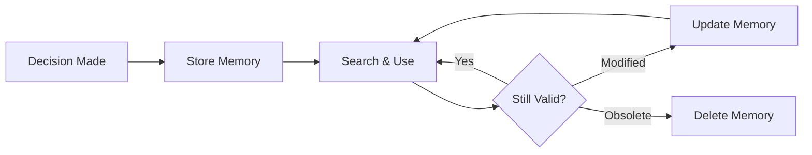

# Memory Management

Learn how to effectively store, search, and organize memories in Doclea.

---

## Memory Types

Doclea supports five memory types. Choose the right type for better search results.

| Type | Use For | Example |
|------|---------|---------|
| **decision** | Architectural choices, technology selections | "Using PostgreSQL for ACID compliance" |
| **solution** | Bug fixes, problem resolutions | "Fixed N+1 with eager loading" |
| **pattern** | Code conventions, standards | "All API errors use RFC7807" |
| **architecture** | System design, infrastructure | "Microservices communication flow" |
| **note** | General documentation | "API rate limits: 1000/min" |

---

## Storing Memories

### Basic Storage

```
"Store this decision: We use JWT tokens for authentication because they're stateless and work across microservices."
```

### With Tags and Context

```
"Store this solution: Fixed the payment race condition by adding database transaction isolation level SERIALIZABLE. Tag it 'payments', 'concurrency', and 'database'. Link it to src/payments/processor.ts."
```

### Best Practices for Content

**Good content includes:**

```markdown
## Decision: Using PostgreSQL

**Context:** Building payment processing system

**Decision:** Use PostgreSQL over MongoDB

**Reasoning:**
1. ACID transactions required for financial data
2. Complex joins across orders, users, products
3. Team expertise with SQL

**Alternatives considered:**
- MongoDB: No multi-document ACID
- MySQL: Inferior JSON support

**Consequences:**
- Need Prisma for TypeScript integration
- Must handle connection pooling
```

**Poor content:**

```
Using PostgreSQL for the database.
```

---

## Searching Memories

### Natural Language Queries

```
"Search memories for authentication decisions"
"Find patterns related to error handling"
"What solutions do we have for performance issues?"
```

### Filtered Searches

```
"Search for decisions tagged with 'security'"
"Find all architecture notes from the last month"
```

### Understanding Results

Search returns results sorted by relevance score (0-1):

| Score | Meaning |
|-------|---------|
| 0.90+ | Highly relevant |
| 0.75-0.90 | Good match |
| 0.60-0.75 | Related |
| < 0.60 | Weak match |

---

## Organizing with Tags

### Tag Strategy

Use 2-5 focused tags per memory:

**Domain tags:** `auth`, `payments`, `api`, `database`

**Type tags:** `security`, `performance`, `refactor`

**Scope tags:** `frontend`, `backend`, `infrastructure`

### Avoid Generic Tags

- `code` - too broad
- `feature` - too vague
- `fix` - use `solution` type instead

---

## Updating Memories

When information changes:

```
"Update the memory about JWT authentication to note that we now use refresh tokens."
```

### When to Update vs Create New

| Situation | Action |
|-----------|--------|
| Correction to existing decision | Update |
| New information adds context | Update |
| Decision was reversed | Create new decision, link to old |
| Completely different topic | Create new |

---

## Deleting Memories

Remove outdated or incorrect memories:

```
"Delete the memory about using MongoDB"
"Remove memories tagged 'deprecated'"
```

:::warning Permanent Deletion
Deleted memories cannot be recovered. Search and verify before deleting.
:::

---

## Memory Lifecycle



---

## Workflows

### Capturing Decisions During Development

1. Make an architectural decision
2. Store immediately while context is fresh
3. Link to relevant files and PRs
4. Tag for future discovery

### Code Review Context

1. Search for related patterns before review
2. Reference existing decisions in review comments
3. Store new patterns discovered during review

### Onboarding New Team Members

1. New member asks about architecture
2. Claude searches Doclea automatically
3. Returns relevant decisions with context
4. No need for senior dev to explain again

---

## Common Patterns

### Architecture Decision Records (ADR)

Store ADRs with consistent structure:

```
"Store this decision with title 'ADR-001: REST vs GraphQL'. Content: We chose REST for public API because... Status: Accepted. Tag it 'adr' and 'api'."
```

### Bug Fix Documentation

```
"Store this solution: Issue #142 - Payment timeout fixed by increasing database connection pool from 5 to 20. Root cause was connection exhaustion under load. Link to src/db/pool.ts and PR #145."
```

### Code Pattern Library

```
"Store this pattern: Repository pattern implementation. All database access goes through repository classes in src/repositories/. Never call Prisma directly from services. Tag 'architecture' and 'database'."
```

---

## Troubleshooting

### "No results found"

- Try broader search terms
- Remove type/tag filters
- Check if memories exist with `"How many memories does doclea have?"`

### "Too many irrelevant results"

- Add type filter: `"Search for decisions about..."`
- Use more specific query terms
- Increase minimum relevance score

### "Duplicate memories"

- Search before storing
- Update existing memories instead of creating new
- Delete duplicates: `"Delete the duplicate memory about..."`

---

## Next Steps

- [Git Integration](./git-integration) - Generate commits and PRs with context
- [Code Expertise](./code-expertise) - Map ownership and suggest reviewers
- [API Reference](../api/overview) - Full tool documentation
