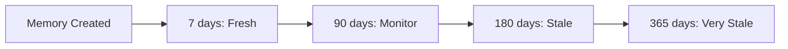
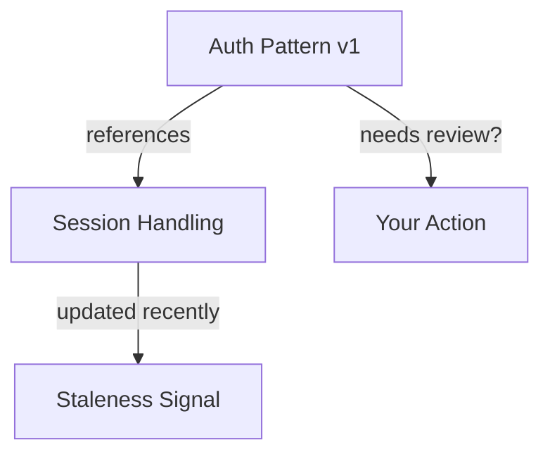

# Memory Staleness & Refresh

Memories are living documents. Code evolves, decisions get revisited, and patterns change. This guide shows you how to detect and handle stale memories.

---

## Why Memories Go Stale

### Time Passes

A decision made 6 months ago might no longer be relevant. The framework you chose might have a better alternative. The constraint that drove a decision might no longer exist.

### Code Changes

When files related to a memory are modified, the memory might need updating:
- Refactored implementations
- Updated APIs
- Changed file structures

### Knowledge Evolves

Related memories get updated, new patterns emerge, or better solutions are discovered. Your original memory might be:
- Partially outdated
- Missing important context
- Superseded by a newer approach

---

## Detection Strategies

Doclea uses four strategies to detect staleness:

### 1. Time Decay

**Question:** "How long since this memory was last verified?"



**Anchor Priority:**
1. `lastRefreshedAt` - When you last verified the memory
2. `accessedAt` - When the memory was last used
3. `createdAt` - When the memory was created

**Example Signal:**
```json
{
  "strategy": "time_decay",
  "score": 0.5,
  "reason": "Memory is 90 days old (50% toward 180-day threshold)",
  "metadata": {
    "ageDays": 90,
    "thresholdDays": 180,
    "anchorType": "createdAt"
  }
}
```

### 2. Git Changes

**Question:** "Have the related files changed since the memory was created?"

When you store a memory with `relatedFiles`, Doclea tracks changes to those files:

```json
{
  "title": "JWT Implementation Pattern",
  "relatedFiles": ["src/auth/jwt.ts", "src/middleware/verify.ts"]
}
```

If `src/auth/jwt.ts` is modified after the memory was last refreshed, you get a signal:

```json
{
  "strategy": "git_changes",
  "score": 0.65,
  "reason": "1 of 2 related files changed: src/auth/jwt.ts",
  "metadata": {
    "changedFiles": ["src/auth/jwt.ts"],
    "totalRelatedFiles": 2,
    "mostRecentChangeAt": 1705320000
  }
}
```

**Scoring:**
| Changed Files | Score |
|---------------|-------|
| 1 file | 0.5 |
| 50% of files | 0.75 |
| All files | 1.0 |

### 3. Related Memory Updates

**Question:** "Have memories this one depends on been updated?"

If your memory references or extends another memory, and that memory is updated, yours might need review.



**Example Signal:**
```json
{
  "strategy": "related_updates",
  "score": 0.4,
  "reason": "Related memory \"Session Management Update\" (extends) was updated more recently",
  "metadata": {
    "fresherRelatedCount": 1,
    "fresherMemories": [{
      "id": "mem_xyz",
      "title": "Session Management Update",
      "relationType": "extends"
    }]
  }
}
```

### 4. Superseded Detection

**Question:** "Has a newer memory replaced this one?"

When you create a memory that supersedes another:

```
"Store this decision: Using Passport.js for auth. This supersedes the previous custom auth decision."
```

The old memory immediately gets flagged:

```json
{
  "strategy": "superseded",
  "score": 1.0,
  "reason": "Superseded by memory mem_abc123",
  "metadata": {
    "supersedingMemoryIds": ["mem_abc123"],
    "supersedingCount": 1
  }
}
```

**Note:** Superseded memories get composite score 1.0 regardless of other signals.

---

## Composite Scoring

All signals are combined using weighted average:

| Strategy | Weight | Rationale |
|----------|--------|-----------|
| Superseded | 1.0 | Definitive - another memory replaces this |
| Git Changes | 0.7 | Strong indicator - code changed |
| Time Decay | 0.5 | Moderate - time alone isn't definitive |
| Related Updates | 0.4 | Weak - related changes don't always matter |

**Formula:**
```
compositeScore = Σ(score × weight) / Σ(weight)
```

**Example:**
```
Time Decay: 0.5 × 0.5 = 0.25
Git Changes: 0.8 × 0.7 = 0.56
─────────────────────────
Sum: 0.81 / 1.2 = 0.675
```

---

## Recommended Actions

Based on composite score:

| Score | Action | What It Means |
|-------|--------|---------------|
| 0.0-0.29 | **None** | Memory is fresh, no action needed |
| 0.3-0.59 | **Review** | Read and verify still accurate |
| 0.6-0.89 | **Refresh** | Update the refresh anchor |
| 0.9-1.0 | **Archive** | Consider deletion or mark historical |

---

## Workflows

### Weekly Maintenance

Run a weekly scan to catch stale memories:

```
"Scan all memories for staleness, show ones needing action"
```

```json
{
  "action": "scan",
  "minScore": 0.3,
  "limit": 100
}
```

**Process each result:**

1. **Review (0.3-0.59)**
   - Read the memory content
   - Check if still accurate
   - Either refresh or update content

2. **Refresh (0.6-0.89)**
   - Verify the memory is still valid
   - Run `refresh` action to reset decay anchor
   - Consider updating importance

3. **Archive (0.9+)**
   - Determine if memory is obsolete
   - Either delete or keep as historical reference
   - Consider creating a superseding memory

### After a Major Refactor

When you've done significant code changes:

```
"Scan memories for staleness, focusing on architecture type"
```

```json
{
  "action": "scan",
  "type": "architecture",
  "minScore": 0.0
}
```

Review all memories with high `git_changes` signals - they likely need content updates.

### Before Critical Decisions

Before relying on a memory for an important decision:

```
"Check if the database migration decision is still current"
```

If stale, investigate before proceeding.

### Creating Superseding Memories

When a decision is replaced:

```
1. Store the new decision
2. Link it to the old with "supersedes" relation
3. The old memory is automatically flagged for archive
```

```
"Store this decision: Migrating from REST to GraphQL for the public API. This supersedes the REST API decision."
```

---

## Refreshing Memories

### What Refresh Does

Refreshing a memory:
1. Updates `lastRefreshedAt` to current time
2. Resets the decay calculation anchor
3. Optionally updates `importance`
4. Does NOT modify content or regenerate embeddings

### When to Refresh

✅ **Do refresh when:**
- You've verified the memory is still accurate
- The content is current but the decay anchor is old
- After reviewing and confirming validity

❌ **Don't refresh when:**
- The content needs updating (use `update` instead)
- You haven't actually verified the memory
- The memory is superseded (archive instead)

### How to Refresh

**Simple refresh:**
```
"Refresh memory mem_abc123"
```

**With importance update:**
```json
{
  "action": "refresh",
  "memoryId": "mem_abc123",
  "newImportance": 0.9
}
```

**Result:**
```json
{
  "before": {
    "importance": 0.5,
    "lastRefreshedAt": 1702900000,
    "effectiveConfidence": 0.32
  },
  "after": {
    "importance": 0.9,
    "lastRefreshedAt": 1705320000,
    "effectiveConfidence": 0.90
  }
}
```

---

## Configuration

### Adjusting Thresholds

Customize when actions are recommended:

```typescript
staleness: {
  thresholds: {
    review: 0.3,    // Lower = more aggressive review suggestions
    refresh: 0.6,   // Lower = suggest refresh earlier
    archive: 0.9    // Lower = suggest archive earlier
  }
}
```

### Strategy Weights

Adjust how much each strategy matters:

```typescript
staleness: {
  strategies: {
    timeDecay: {
      thresholdDays: 180,  // Days until fully stale
      weight: 0.5          // Relative importance
    },
    gitChanges: {
      weight: 0.7,         // High - code changes are significant
      cacheTtlMs: 300000   // 5-minute git cache
    },
    relatedUpdates: {
      weight: 0.4,         // Medium - not always relevant
      maxDepth: 2          // How deep to traverse relations
    },
    superseded: {
      weight: 1.0          // Maximum - superseded means stale
    }
  }
}
```

### Disabling Staleness

If you don't want staleness detection:

```typescript
staleness: {
  enabled: false
}
```

---

## Integration with Confidence Decay

Staleness detection works alongside [Confidence Decay](/docs/architecture/confidence-decay):

| Feature | Purpose |
|---------|---------|
| **Confidence Decay** | Reduces search ranking over time |
| **Staleness Detection** | Identifies memories needing attention |

They complement each other:
- Confidence decay affects search results automatically
- Staleness detection prompts human action
- Refresh resets both systems

---

## Best Practices

### 1. Add Related Files

Always include `relatedFiles` when storing:

```json
{
  "title": "Error Handling Pattern",
  "relatedFiles": ["src/errors/handler.ts", "src/middleware/errors.ts"]
}
```

This enables git change detection.

### 2. Link Related Memories

Create explicit relations:

```
"Link the new auth pattern to the session management decision"
```

This enables related updates detection.

### 3. Use Supersedes Relations

When replacing a decision:

```
"Create a supersedes relation from the new memory to the old one"
```

This automatically flags the old memory for archive.

### 4. Run Regular Scans

Weekly or bi-weekly scans catch issues early:

```
"Scan all memories with staleness score above 0.3"
```

### 5. Don't Auto-Archive

Always review before archiving. A high staleness score doesn't mean the content is wrong - it means verification is needed.

---

## Troubleshooting

### Git Changes Not Detected

**Symptom:** Related files changed but no signal

**Causes:**
1. Files not in `relatedFiles` array
2. Changes older than 6 months
3. Not a git repository
4. Git cache not expired (wait 5 minutes)

**Solution:** Ensure `relatedFiles` are accurate and changes are recent.

### All Memories Showing Stale

**Symptom:** Everything has high staleness scores

**Causes:**
1. Time decay threshold too aggressive
2. No recent refreshes
3. Bulk import without setting `lastRefreshedAt`

**Solution:** Adjust `thresholdDays` or do a bulk refresh of verified memories.

### Superseded Not Detected

**Symptom:** Memory has supersedes relation but no signal

**Causes:**
1. Relation direction reversed (should point TO the old memory)
2. Relation type not "supersedes"

**Solution:** Verify relation: `newMemory --supersedes--> oldMemory`

---

## Next Steps

- [API Reference: doclea_staleness](/docs/api/staleness/overview)
- [Confidence Decay Architecture](/docs/architecture/confidence-decay)
- [Memory Relations Guide](/docs/guides/memory-relations)
