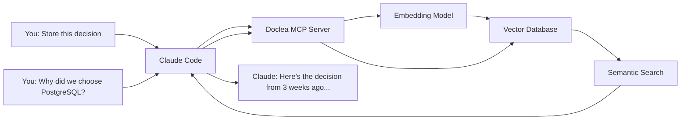

# Doclea

**Persistent memory for AI coding assistants.**

Your AI assistant forgets everything after each session. Doclea remembers.

## 30-Second Setup

Add to `~/.claude.json`:

```json
{
  "mcpServers": {
    "doclea": {
      "command": "npx",
      "args": ["@doclea/mcp"]
    }
  }
}
```

Restart Claude Code, navigate to your project, then ask:

> "Initialize doclea for this project"

**That's it.** You now have persistent memory across all sessions.

[Full Installation Guide →](./installation/overview)

---

## The Problem

Every time you start a new chat with your AI assistant:

- You re-explain architectural decisions
- You re-describe bug fixes you've already solved
- You lose context about codebase patterns
- Your AI can't remember conversations from yesterday

**You spend more time teaching your AI than coding.**

---

## The Solution

Doclea gives your AI assistant **persistent, searchable memory**:

| Feature | What It Does |
|---------|--------------|
| **Remember Everything** | Store decisions, patterns, solutions, and context |
| **Instant Recall** | Semantic search finds relevant memories automatically |
| **Zero-Config** | Works immediately, no Docker required |
| **Privacy First** | All data stays local on your machine |

---

## How It Works



---

## Features

### Memory Tools

Store and search architectural decisions, bug solutions, code patterns, and notes.

```
"Store this decision: Using JWT for stateless auth across microservices"
"Search memories for authentication patterns"
```

### Git Integration

Generate commit messages, PR descriptions, and changelogs with full context.

```
"Generate a commit message for these staged changes"
"Create a PR description for this branch"
```

### Code Expertise

Map code ownership and suggest reviewers based on git history.

```
"Who are the experts for the payment module?"
"Suggest reviewers for this PR"
```

### Bootstrap

Initialize projects by scanning codebase, git history, and existing docs.

```
"Initialize doclea for this project"
"Import decisions from our ADR folder"
```

---

## Zero-Config vs Docker

| Setup | Best For | Performance |
|-------|----------|-------------|
| **Zero-Config** | Getting started, small projects | Good (sqlite-vec + Transformers.js) |
| **Docker** | Large codebases, teams | 3-5x faster (Qdrant + TEI) |

Doclea auto-detects your environment. Start with zero-config, upgrade when needed.

[Configuration Options →](./configuration)

---

## Quick Links

- [Quick Start](./quick-start) - Get productive in 3 minutes
- [Memory Management](./guides/memory-management) - Store and search effectively
- [API Reference](./api/overview) - All 62 MCP tools documented
- [Troubleshooting](./troubleshooting) - Common issues and fixes

---

## Ready to Give Your AI a Memory?

```json
{
  "mcpServers": {
    "doclea": {
      "command": "npx",
      "args": ["@doclea/mcp"]
    }
  }
}
```

[Get Started →](./quick-start)
