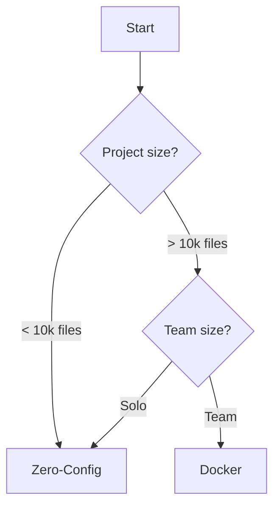

# Installation Overview

Choose the installation method that fits your needs.

## Quick Comparison

| Method | Best For | Setup Time |
|--------|----------|------------|
| [Zero-Config](./zero-config) | Getting started, small projects | 30 seconds |
| [Docker](./docker) | Large codebases, teams | 5 minutes |

## Decision Guide

## Next Steps

- [Zero-Config Setup](./zero-config) - Start here
- [Docker Setup](./docker) - For production workloads
- [Verification](./verification) - Test your installation
